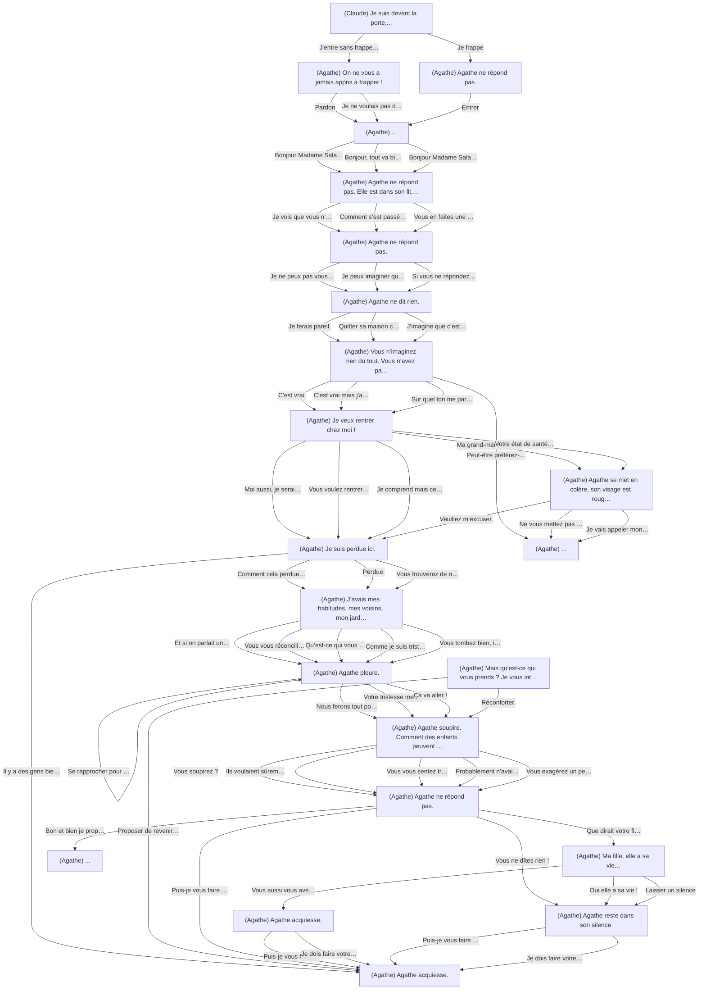
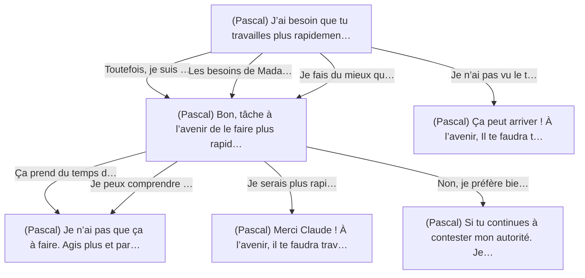
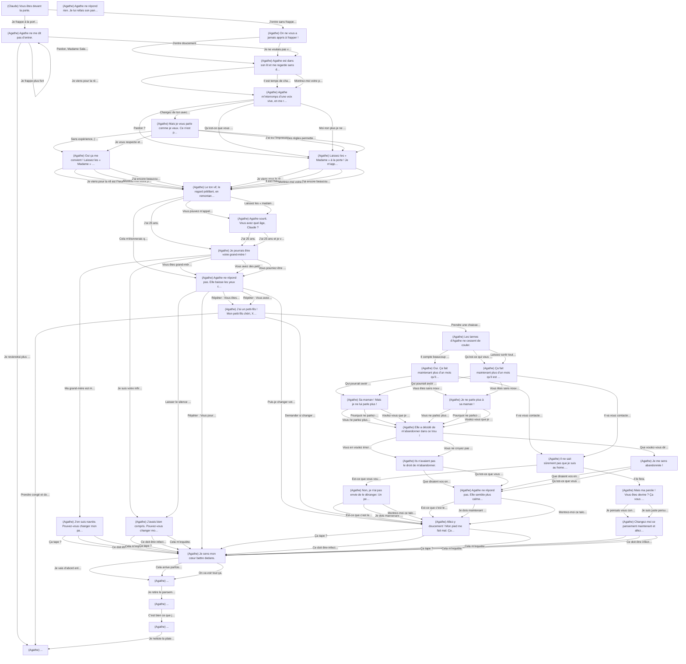
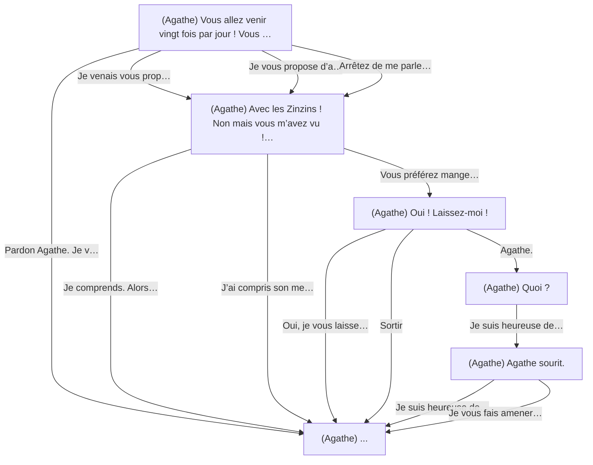
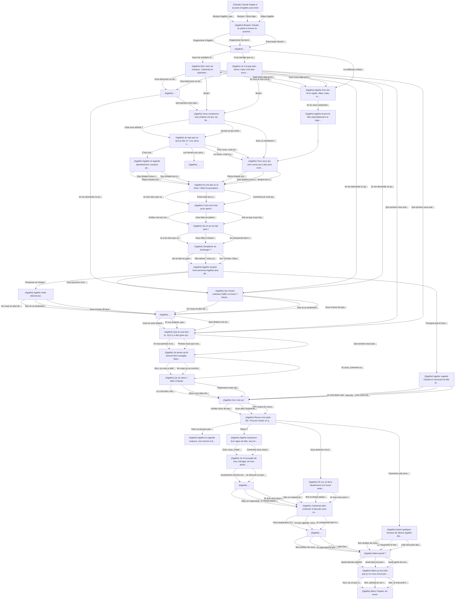
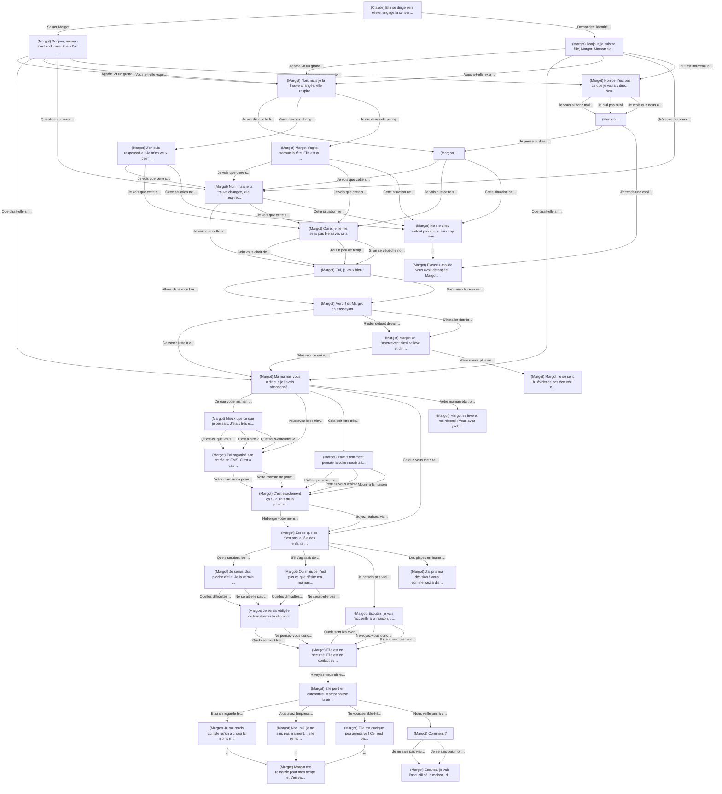

# Graphes End of Life

Structure des scénarios — Généré à partir de Chapters_v2-1.json

---

## Chapitre 1 : La rencontre

### Scénario : Présentation

*22 nœuds, 60 arêtes*

---

### Scénario : Vite fait bien fait

*6 nœuds, 8 arêtes*

---

### Scénario : Les soins

*35 nœuds, 95 arêtes*

---

### Scénario : Le dîner

*6 nœuds, 13 arêtes*

---

## Chapitre 2 : Vivre en EMS

### Scénario : Lieu de vie, lieu de mort

*38 nœuds, 105 arêtes*

---

### Scénario : Projet de vie

```mermaid
flowchart TD
    I1["(Claude) ..."]
    I2["(Agathe) Mais attendez donc que je vous réponde ! Que…"]
    I3["(Agathe) Je vais finir par me fâcher et m'adressez à …"]
    I4["(Agathe) Agathe est dans son fauteuil : Gentiment."]
    I5["(Agathe) Oui, ça va, je m’ennuie un peu."]
    I6["(Agathe) Tout à fait."]
    I7["(Agathe) Agathe se lève et s’installe dans son lit. C…"]
    I8["(Agathe) Agathe soupire."]
    I9["(Agathe) Oui, avec mon diabète, vous savez j’avais pe…"]
    I10["(Agathe) Oui, qu’on m’ampute !!! Agathe attrape son d…"]
    I11["(Agathe) Oui que je sois amputée, avec le diabète on …"]
    I12["(Agathe) Pas vraiment. Je me rappelle… que vous aviez…"]
    I13["(Agathe) Agathe sourit, ses yeux brillent, pétillent…"]
    I14["(Agathe) Agathe, des étoiles dans les yeux. Rêver !"]
    I15["(Agathe) Rimbaud, Baudelaire… J’aime les mots. Voler …"]
    I16["(Agathe) Non, non, je ne souhaite déranger personne ……"]
    I17["(Agathe) J’ai beaucoup lu dans ma vie. Des poèmes ! Ç…"]
    I18["(Agathe) Oh oui ! Je serais ravie."]
    I19["(Agathe) Vous feriez ça pour moi ! Merci Claude ! Du …"]
    I20["(Agathe) Xavier ! Il est parti travailler aux Etats-U…"]
    I21["(Agathe) Oui, les lettres sont grandes, c’est plus fa…"]
    I22["(Agathe) Oui nous avions pris l’habitude de jouer ens…"]
    I23["(Agathe) Oui, si je suis libre d’y aller quand je veu…"]
    I24["(Agathe) Je suis obligée de prendre mes médicaments q…"]
    I25["(Agathe) Agathe sourit."]
    I26["(Agathe) C'est tout ou rien, je l'ai fait jusqu'à pré…"]
    I27["(Agathe) C'est tout ou rien, je l'ai fait jusqu'à pré…"]
    I28["(Agathe) C'est tout ou rien, je l'ai fait jusqu'à pré…"]
    I29["(Agathe) Oui merci Claude. Je salue Agathe et je sors…"]
    I30["(Agathe) Je comprends. Merci pour votre temps. Je sal…"]
    I31["(Agathe) Je suis en paix avec eux ! Ils me manquent !"]
    I32["(Agathe) J’appellerai Margot aujourd’hui. La dernière…"]
    I33["(Agathe) Ma foi je ne sais pas si je me souviens de t…"]
    I34["(Agathe) Je ne pensais pas pouvoir encore vivre de bo…"]
    I35["(Agathe) ..."]
    I36["(Agathe) J’ai le sentiment de ne plus avoir de famill…"]
    I37["(Agathe) Oui, je ne sais pas trop quoi faire ici."]
    I38["(Agathe) C’est, vrai, ma maison, mon jardin me manque…"]
    I39["(Agathe) Justement, avant de venir ici, je n'ai jamai…"]
    I40["(Agathe) Il ne s’agit pas de ça… Agathe secoue la têt…"]

    I1 -->|"Prendre du temps po…"| I4
    I1 -->|"Prendre un temps po…"| I2
    I1 -->|"Prendre un temps po…"| I2
    I2 -->|"Excusez-moi, je sui…"| I3
    I2 -->|"Excusez-moi, je sui…"| I3
    I2 -->|"Excusez-moi, j'oubl…"| I3
    I3 -->|"J'entends bien, je …"| I6
    I3 -->|"Dites m'en plus Aga…"| I37
    I3 -->|"Je vous entends Aga…"| I38
    I3 -->|"Qu’aimiez-vous donc…"| I39
    I4 -->|"Gentiment."| I5
    I4 -->|"Êtes-vous en colère…"| I5
    I5 -->|"J'entends bien, je …"| I6
    I5 -->|"Dites m'en plus Aga…"| I37
    I5 -->|"Je vous entends Aga…"| I38
    I5 -->|"Qu’aimiez-vous donc…"| I39
    I5 -->|"L'animatrice ne vou…"| I40
    I6 -->|"Bien. Je vais faire…"| I7
    I6 -->|"Couchez-vous s'il v…"| I7
    I6 -->|"Allez, laissez moi …"| I7
    I7 -->|"Votre pied va mieux…"| I8
    I7 -->|"Votre pied va mieux…"| I8
    I8 -->|"Vous êtes soulagée."| I9
    I8 -->|"Quel soupire !"| I9
    I9 -->|"Vous aviez très peu…"| I10
    I9 -->|"Aviez-vous si peur ?"| I11
    I10 -->|"Vous souvenez-vous …"| I12
    I10 -->|"Vous rappelez-vous …"| I12
    I10 -->|"Bon on reprend la d…"| I12
    I11 -->|"Vous souvenez-vous …"| I12
    I11 -->|"Vous rappelez-vous …"| I12
    I11 -->|"Bon on reprend la d…"| I12
    I12 -->|"Oui et nous avons r…"| I13
    I12 -->|"Oui mais sourtout c…"| I13
    I13 -->|"Quel sourire ! Vous…"| I14
    I13 -->|"Je vous vois revivr…"| I14
    I14 -->|"Qu’est-ce qui vous …"| I15
    I14 -->|"Et de quoi rêvez-vo…"| I15
    I14 -->|"Dites m'en plus."| I15
    I15 -->|"Est-ce que vous lis…"| I17
    I15 -->|"Nous avons une bibl…"| I16
    I16 -->|"Vous auriez plaisir…"| I18
    I16 -->|"Aimeriez-vous que l…"| I18
    I16 -->|"Et si on vous lisai…"| I18
    I17 -->|"Vous auriez plaisir…"| I18
    I17 -->|"Aimeriez-vous que l…"| I18
    I17 -->|"Et si on vous lisai…"| I18
    I18 -->|"Je vais en parler à…"| I19
    I18 -->|"Vous pourrez en par…"| I19
    I19 -->|"Je vous en prie, Ag…"| I20
    I19 -->|"Pas de soucis ! Un …"| I20
    I20 -->|"Vous jouez au scrab…"| I21
    I20 -->|"Xavier et vous joui…"| I22
    I21 -->|"Vous voudriez peut-…"| I23
    I21 -->|"Jouez au scarbble a…"| I23
    I22 -->|"Cela me rappelle le…"| I23
    I22 -->|"C'est toujours symp…"| I23
    I23 -->|"C’est important que…"| I24
    I23 -->|"N'oubliez pas que p…"| I24
    I23 -->|"Bien entendu que vo…"| I24
    I24 -->|"Je vais en parler à…"| I25
    I24 -->|"Nous pourrions voir…"| I26
    I24 -->|"Nous sommes garante…"| I27
    I24 -->|"Vous pourriez peut …"| I28
    I24 -->|"Il est mieux que no…"| I30
    I25 -->|"Comment vous sentez…"| I31
    I25 -->|"Vous pensez toujour…"| I31
    I26 -->|"Comment vous sentez…"| I31
    I26 -->|"Vous pensez toujour…"| I31
    I27 -->|"Pensez-vous que nou…"| I29
    I27 -->|"On a fait le tour ?"| I29
    I31 -->|"Avez-vous songé à l…"| I32
    I31 -->|"Ils vous manquent ?"| I36
    I32 -->|"Faire un résumé de …"| I34
    I32 -->|"Faire un résumé de …"| I29
    I32 -->|"Agathe, pourriez-vo…"| I33
    I33 -->|"Faire un résumé de …"| I34
    I33 -->|"Faire un résumé de …"| I29
    I34 -->|"Je vous en prie Aga…"| I35
    I36 -->|"Vous souhaitez revo…"| I32
    I36 -->|"Maintenant vous vou…"| I32
    I37 -->|"J'entends bien, je …"| I6
    I37 -->|"Je vous entends Aga…"| I38
    I37 -->|"Qu’aimiez-vous donc…"| I39
    I37 -->|"L'animatrice ne vou…"| I40
    I38 -->|"Nous devons nous vo…"| I6
    I38 -->|"Allez on s'y met. V…"| I6
    I38 -->|"C'est à votre tour …"| I6
    I39 -->|"Bien. Je vais faire…"| I7
    I39 -->|"Couchez-vous s'il v…"| I7
    I39 -->|"Allez, laissez moi …"| I7
```

*40 nœuds, 91 arêtes*

---

### Scénario : Culpabilité des proches

*37 nœuds, 81 arêtes*

---

## Chapitre 3 : La fin de vie

### Scénario : Les dernières volontés

```mermaid
flowchart TD
    I1["(Claude) Claude est maintenant devant la porte de la …"]
    I2["(Agathe) Claude, je suis contente de vous voir."]
    I3["(Agathe) C’est difficile. J’ai de la peine à respirer…"]
    I4["(Agathe) Oui, partir."]
    I5["(Agathe) Oui."]
    I6["(Agathe) J’ai le souffle court. Le médecin m’a mis so…"]
    I7["(Agathe) Non, mais je veux pas être réanimée ! Je veu…"]
    I8["(Agathe) Oui."]
    I9["(Agathe) Je ne veux pas devenir un légume ! Je veux c…"]
    I10["(Agathe) Agathe regarde le plafond. Son regard est ré…"]
    I11["(Agathe) J’aimerais que vous me fassiez la piqure."]
    I12["(Agathe) Oui, maintenant."]
    I13["(Agathe) Vous m’avez donné des nouveaux médicaments !…"]
    I14["(Agathe) ..."]
    I15["(Agathe) Oui, c’est pour ça que je veux mourir mainte…"]
    I16["(Agathe) Oui et ça me fait peur."]
    I17["(Agathe) Mais pourquoi faire ?"]
    I18["(Agathe) Mais je suis pas en état d’écrire quoi que c…"]
    I19["(Agathe) Je sais pas ce que c’est."]
    I20["(Agathe) Je sais pas si j’en suis capable."]
    I21["(Agathe) Je ne veux pas mourir étouffée."]
    I22["(Agathe) Mais je vous ai dit que je ne voulais pas de…"]
    I23["(Agathe) Aidez-moi à respirer et faîtes-moi voir ces …"]
    I24["(Agathe) Agathe soupire. Son visage manifeste de l’in…"]

    I1 -->|"Frappe et entre"| I2
    I2 -->|"Moi aussi, Agathe,"| I3
    I3 -->|"Vous en aller ?"| I4
    I4 -->|"Vous avez l’impress…"| I5
    I5 -->|"Qu’est-ce qui vous …"| I6
    I6 -->|"Le médecin vous a b…"| I7
    I7 -->|"Claude prend une ch…"| I8
    I8 -->|"Est-ce que vous ave…"| I9
    I9 -->|"Vous voulez choisir…"| I10
    I10 -->|"Qu’est-ce que vous …"| I11
    I11 -->|"Vous aimeriez que j…"| I12
    I12 -->|"Est-ce qu’il y a en…"| I13
    I13 -->|"Agathe, ce que vous…"| I14
    I14 -->|"Mourir étouffée, ce…"| I15
    I15 -->|"Si je résume un peu"| I16
    I16 -->|"Agathe, est-ce que …"| I17
    I17 -->|"Pour que l’on puiss…"| I18
    I18 -->|"Je peux vous aider …"| I19
    I19 -->|"C’est mettre par éc…"| I20
    I20 -->|"Je peux vous aider."| I21
    I21 -->|"Nous pouvons vous p…"| I22
    I22 -->|"L’un n’empêche pas …"| I23
    I23 -->|"Très bien Agathe"| I24
```

*24 nœuds, 23 arêtes*

---

### Scénario : Les professionnels face à la mort

```mermaid
flowchart TD
    I1["(Pascal) Salut Claude. Je sors d’une séance avec la d…"]
    I2["(Pascal) Oui, dix mais pas quinze. Pascal ferme la po…"]
    I3["(Pascal) Oui, elle n’a pas changé. Tu as bien fait."]
    I4["(Pascal) De tes valeurs ?"]
    I5["(Pascal) Oui, mais là elle ne veut plus être soignée."]
    I6["(Pascal) Tu lui as proposé de la soulager ?"]
    I7["(Pascal) Agathe est une personne capable de discernem…"]
    I8["(Pascal) Encore une fois tu n’es pas responsable de s…"]
    I9["(Pascal) Nos clients meurent ici que tu le veuilles o…"]
    I10["(Pascal) Bien sûr, mais cela touche une minorité de c…"]
    I11["(Pascal) Non, surtout pas."]
    I12["(Pascal) Oui, tu peux par contre soutenir Agathe dans…"]
    I13["(Pascal) Il ne s’agit pas de toi mais d’Agathe."]
    I14["(Pascal) Là, je trouve que tu exagères. Et en plus le…"]
    I15["(Pascal) Je t’en prie. Il sort, pressé comme à son ha…"]

    I1 -->|"C’est une bonne nou…"| I2
    I2 -->|"Je ne me sens pas t…"| I3
    I3 -->|"Je suis soulagée"| I4
    I4 -->|"Je suis très embarr…"| I5
    I5 -->|"Pascal, j’ai l’impr…"| I6
    I6 -->|"Oui, bien sûr !"| I7
    I7 -->|"Je sais tout ça."| I8
    I8 -->|"Mais enfin Pascal,"| I9
    I9 -->|"Je sais bien."| I10
    I10 -->|"Est-ce qu’il n’y au…"| I11
    I11 -->|"Ce choix lui appart…"| I12
    I12 -->|"Mais enfin Pascal."| I13
    I13 -->|"Ce temps de vie d’A…"| I14
    I14 -->|"Je dois commencer à…"| I15
```

*15 nœuds, 14 arêtes*

---

### Scénario : Acceptation inconditionnelle

```mermaid
flowchart TD
    I1["(Claude) Claude frappe et entre"]
    I2["(Agathe) Agathe est alitée. Elle parle lentement à vo…"]
    I3["(Agathe) Charlotte, ce matin. Elle a insisté ! Je ne …"]
    I4["(Agathe) Je m’étrangle ! J’ai plus envie de boire."]
    I5["(Agathe) J’en peux plus."]
    I6["(Agathe) Arrêtez ça !"]
    I7["(Agathe) Oui, arrêtez ça."]
    I8["(Agathe) Oui."]
    I9["(Agathe) Oui, on l’a écrit sur un papier."]
    I10["(Agathe) Merci !"]
    I11["(Agathe) C’est ma décision ! Merci de me respecter."]
    I12["(Agathe) N’en parlez pas à mes enfants."]
    I13["(Agathe) Ma fille me forcera à boire."]
    I14["(Agathe) Ça changerait tout."]
    I15["(Agathe) Oui."]
    I16["(Agathe) Des larmes coulent sur les joues d’Agathe. C…"]
    I17["(Agathe) Je veux mourir seule."]
    I18["(Agathe) Non. Laissez-moi reposer en paix."]

    I1 -->|"Vous avez sonné Aga…"| I2
    I2 -->|"On vous a forcé à b…"| I3
    I3 -->|"Vous n’arrivez plus…"| I4
    I4 -->|"Ça devient trop dif…"| I5
    I5 -->|"C’est important de …"| I6
    I6 -->|"Ce n’est plus suppo…"| I7
    I7 -->|"Vous souhaitez qu’o…"| I8
    I8 -->|"Si j’ai bien compri…"| I9
    I9 -->|"Je vais transmettre…"| I10
    I10 -->|"Votre décision me t…"| I11
    I11 -->|"Long silence."| I12
    I12 -->|"Quand ma grand-maman"| I13
    I13 -->|"Et si votre fille a…"| I14
    I14 -->|"Ce qui est important"| I15
    I15 -->|"J’ai l’impression"| I16
    I16 -->|"Ça vous rend triste."| I17
    I17 -->|"Long silence."| I18
```

*18 nœuds, 17 arêtes*

---
