# Graphes End of Life

Structure des scénarios — Généré à partir de Chapters_v3-4-c_emotional-illustration.json

---

## Chapitre 1 : La rencontre

### Scénario : Présentation

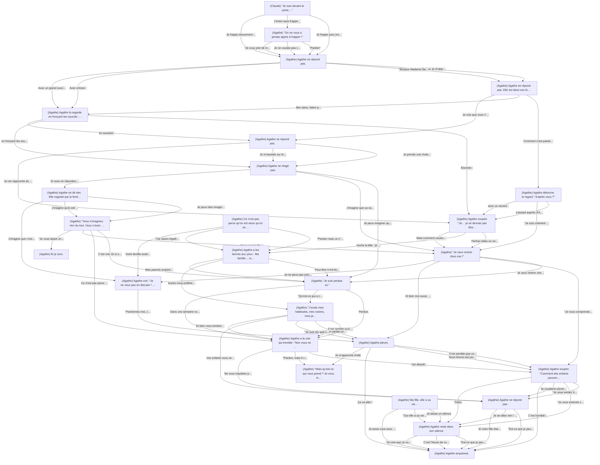
```mermaid
flowchart TD
    I1["(Claude) ''Je suis devant la porte,...''"]
    I2["(Agathe) ''On ne vous a jamais appris à frapper !''"]
    I3["(Agathe) Agathe ne répond pas."]
    I4["(Agathe) Agathe ne répond pas. Elle est dans son lit.…"]
    I5["(Agathe) Agathe la regarde en fronçant les sourcils :…"]
    I6["(Agathe) Agathe détourne le regard :''d’après vous ?''"]
    I7["(Agathe) Agathe ne répond pas."]
    I8["(Agathe) Agathe soupire :''Je… je ne devrais pas être…"]
    I9["(Agathe) Agathe ne réagit pas."]
    I10["(Agathe) Agathe ne dit rien. Elle regarde par la fenê…"]
    I11["(Agathe) ''Vous n’imaginez rien du tout. Vous n’avez …"]
    I12["(Agathe) Ce n’est pas parce qu’on est vieux qu’on ne …"]
    I13["(Agathe) ''Je veux rentrer chez moi !''"]
    I14["(Agathe) Agathe crie :''Je ne veux pas en discuter ! …"]
    I15["(Agathe) Agathe a les larmes aux yeux : Ma famille… m…"]
    I16["(Agathe) ''Je suis perdue ici.''"]
    I17["(Agathe) ''J’avais mes habitudes, mes voisins, mon ja…"]
    I18["(Agathe) Agathe a la voix qui tremble :''Non vous ne …"]
    I19["(Agathe) Agathe pleure."]
    I20["(Agathe) ''Mais qu’est-ce qui vous prend ? Je vous in…"]
    I21["(Agathe) Agathe soupire :''Comment des enfants peuven…"]
    I22["(Agathe) Agathe ne répond pas."]
    I23["(Agathe) Ma fille, elle a sa vie…"]
    I24["(Agathe) Agathe reste dans son silence"]
    I25["(Agathe) Agathe acquiesse."]
    I26["(Agathe) Et je sors."]

    I1 -->|"Je frappe puis j’en…"| I3
    I1 -->|"J’entre sans frappe…"| I2
    I1 -->|"Je frappe doucement…"| I3
    I2 -->|"''Pardon''"| I3
    I2 -->|"Je ne voulais pas v…"| I3
    I2 -->|"''Je vous prie de m…"| I3
    I3 -->|"''Bonjour, je m’app…"| I4
    I3 -->|"''Bonjour Madame Sa…"| I4
    I3 -->|"Avec entrain :"| I5
    I3 -->|"Avec un grand souri…"| I5
    I4 -->|"Comment s’est passé…"| I6
    I4 -->|"Ben alors, faites p…"| I5
    I4 -->|"Je vois que vous n’…"| I7
    I5 -->|"Étonnée :"| I8
    I5 -->|"en fronçant les sou…"| I9
    I5 -->|"en souriant :"| I7
    I6 -->|"s’assied auprès d’A…"| I8
    I6 -->|"''Je suis vraiment …"| I13
    I6 -->|"avec un sourire :"| I8
    I7 -->|"Je prends une chais…"| I9
    I7 -->|"Je m’assieds sur le…"| I9
    I7 -->|"Je me rapproche du …"| I8
    I8 -->|"Parfois hélas on ne…"| I13
    I8 -->|"hoche la tête : je …"| I15
    I8 -->|"Mais comment voulez…"| I13
    I9 -->|"Je peux imaginer qu…"| I16
    I9 -->|"J’imagine que ça va…"| I13
    I9 -->|"Si vous ne répondez…"| I10
    I10 -->|"Je peux bien imagin…"| I11
    I10 -->|"J’imagine qu’à votr…"| I11
    I10 -->|"J’imagine que c’est…"| I14
    I11 -->|"C’est vrai. Et si u…"| I16
    I11 -->|"Ce n’est pas parce …"| I18
    I11 -->|"C’est vrai j’ai 25 …"| I13
    I11 -->|"''Je vous laisse un…"| I26
    I12 -->|"''Pardon mais ce n’…"| I15
    I12 -->|"''J’ai raison Agath…"| I15
    I12 -->|"Votre famille avait…"| I14
    I13 -->|"Je veux rentrer che…"| I16
    I13 -->|"''Je vous comprends…"| I21
    I13 -->|"Et bien moi aussi, …"| I19
    I13 -->|"Je ne peux pas rent…"| I14
    I14 -->|"''Pardonnez-moi, j’…"| I19
    I15 -->|"Peut-être n’ont-ils…"| I16
    I15 -->|"Auriez-vous préféré…"| I17
    I15 -->|"Mes parents avaient…"| I16
    I16 -->|"Perdue."| I18
    I16 -->|"''Qu’est-ce qui a c…"| I17
    I16 -->|"Dans une semaine vo…"| I18
    I17 -->|"Il me semble qu’il …"| I18
    I17 -->|"Et si on parlait un…"| I19
    I17 -->|"''Je suis sûr que v…"| I19
    I17 -->|"Vos enfants vous on…"| I22
    I17 -->|"Et bien vous tombez…"| I18
    I18 -->|"l’air désolé :"| I21
    I18 -->|"''Pardon, mais il v…"| I20
    I18 -->|"Ne vous inquiétez p…"| I22
    I19 -->|"Il me semble que vo…"| I21
    I19 -->|"Nous ferons tout po…"| I21
    I19 -->|"Ça va aller !"| I25
    I19 -->|"Je m’approche d’elle"| I20
    I21 -->|"''Je vous sentez tr…"| I22
    I21 -->|"''Je vous entends s…"| I24
    I21 -->|"Ils voulaient sûrem…"| I22
    I21 -->|"C’est horrible !"| I25
    I21 -->|"Trahir,"| I24
    I22 -->|"''Est-ce que je peu…"| I25
    I22 -->|"Je ne dites rien ! …"| I24
    I22 -->|"Si votre fille étai…"| I25
    I23 -->|"Je laisse un silence"| I24
    I23 -->|"''Oui elle a sa vie…"| I24
    I23 -->|"Je aussi vous avez …"| I25
    I24 -->|"''Est-ce que je peu…"| I25
    I24 -->|"C’est l’heure de vo…"| I25
    I24 -->|"''Je vois que ce su…"| I25
```

*26 nœuds, 75 arêtes*

---

### Scénario : Vite fait bien fait

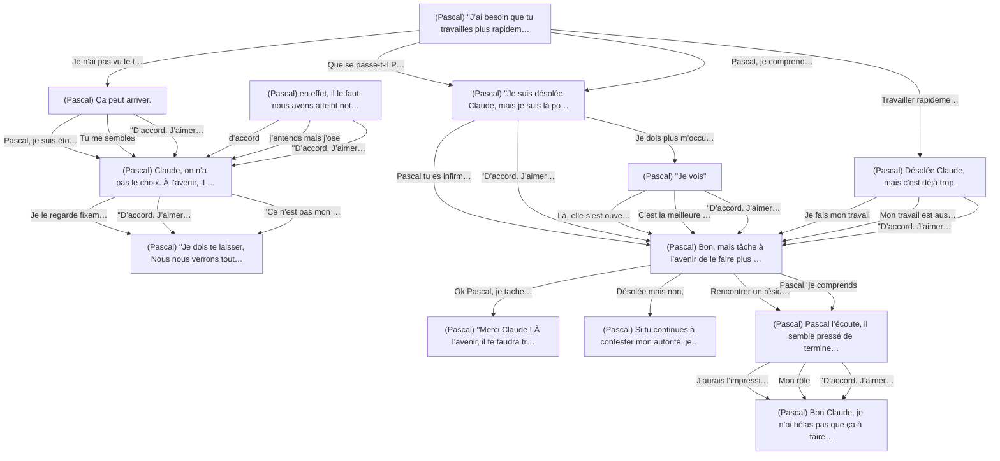
```mermaid
flowchart TD
    I1["(Pascal) ''J’ai besoin que tu travailles plus rapidem…"]
    I2["(Pascal) ''Je suis désolée Claude, mais je suis là po…"]
    I3["(Pascal) ''Je vois''"]
    I4["(Pascal) Ça peut arriver."]
    I5["(Pascal) en effet, il le faut, nous avons atteint not…"]
    I6["(Pascal) Claude, on n’a pas le choix. À l’avenir, Il …"]
    I7["(Pascal) ''Je dois te laisser, Nous nous verrons tout…"]
    I8["(Pascal) Désolée Claude, mais c’est déjà trop."]
    I9["(Pascal) Bon, mais tâche à l’avenir de le faire plus …"]
    I10["(Pascal) ''Merci Claude ! À l’avenir, il te faudra tr…"]
    I11["(Pascal) Si tu continues à contester mon autorité, je…"]
    I12["(Pascal) Pascal l’écoute, il semble pressé de termine…"]
    I13["(Pascal) Bon Claude, je n’ai hélas pas que ça à faire…"]

    I1 -->|"Que se passe-t-il P…"| I2
    I1 -->|"Pascal, je comprend…"| I2
    I1 -->|"Je n’ai pas vu le t…"| I4
    I1 -->|"Travailler rapideme…"| I8
    I2 -->|"Pascal tu es infirm…"| I9
    I2 -->|"Je dois plus m’occu…"| I3
    I2 -->|"''D’accord. J’aimer…"| I9
    I3 -->|"Là, elle s’est ouve…"| I9
    I3 -->|"C’est la meilleure …"| I9
    I3 -->|"''D’accord. J’aimer…"| I9
    I4 -->|"Pascal, je suis éto…"| I6
    I4 -->|"Tu me sembles"| I6
    I4 -->|"''D’accord. J’aimer…"| I6
    I5 -->|"d’accord"| I6
    I5 -->|"j’entends mais j’ose"| I6
    I5 -->|"''D’accord. J’aimer…"| I6
    I6 -->|"Je le regarde fixem…"| I7
    I6 -->|"''D’accord. J’aimer…"| I7
    I6 -->|"''Ce n’est pas mon …"| I7
    I8 -->|"Je fais mon travail"| I9
    I8 -->|"Mon travail est aus…"| I9
    I8 -->|"''D’accord. J’aimer…"| I9
    I9 -->|"Rencontrer un résid…"| I12
    I9 -->|"Pascal, je comprends"| I12
    I9 -->|"Désolée mais non,"| I11
    I9 -->|"Ok Pascal, je tache…"| I10
    I12 -->|"J’aurais l’impressi…"| I13
    I12 -->|"Mon rôle"| I13
    I12 -->|"''D’accord. J’aimer…"| I13
```

*13 nœuds, 29 arêtes*

---

### Scénario : Les soins

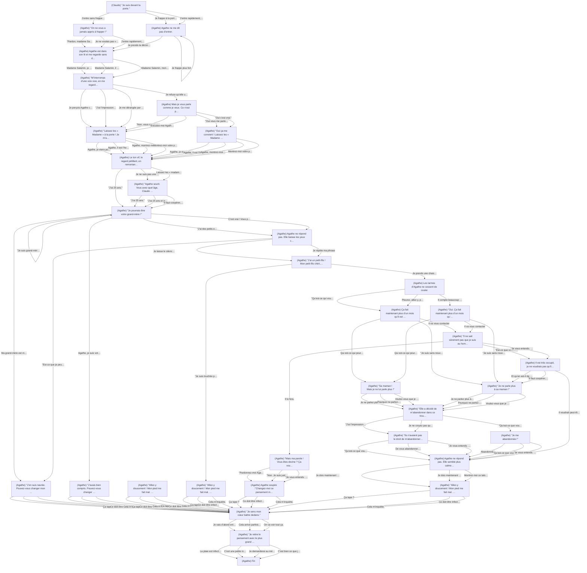
```mermaid
flowchart TD
    I1["(Claude) ''Je suis devant la porte.''"]
    I2["(Agathe) ''On ne vous a jamais appris à frapper !''"]
    I3["(Agathe) Agathe ne me dit pas d’entrer."]
    I4["(Agathe) Agathe est dans son lit et me regarde sans d…"]
    I5["(Agathe) ''M’interromps d’une voix vive, en me regard…"]
    I6["(Agathe) Mais je vous parle comme je veux. Ce n’est p…"]
    I7["(Agathe) ''Laissez les « Madame » à la porte ! Je m’a…"]
    I8["(Agathe) ''Oui ça me convient ! Laissez les « Madame …"]
    I9["(Agathe) Le ton vif, le regard pétillant, en remontan…"]
    I10["(Agathe) ''Agathe sourit. Vous avez quel âge, Claude …"]
    I11["(Agathe) ''Je pourrais être votre grand-mère !''"]
    I12["(Agathe) ''J’en suis navrée. Pouvez-vous changer mon …"]
    I13["(Agathe) ''J’avais bien compris. Pouvez-vous changer …"]
    I14["(Agathe) Agathe ne répond pas. Elle baisse les yeux c…"]
    I15["(Agathe) ''Allez-y doucement ! Mon pied me fait mal. …"]
    I16["(Agathe) ''J’ai un petit-fils ! Mon petit-fils chéri,…"]
    I17["(Agathe) ''Allez-y doucement ! Mon pied me fait mal. …"]
    I18["(Agathe) Les larmes d’Agathe ne cessent de couler."]
    I19["(Agathe) Ça fait maintenant plus d’un mois qu’il est …"]
    I20["(Agathe) ''Oui. Ça fait maintenant plus d’un mois qu’…"]
    I21["(Agathe) ''Il ne sait sûrement pas que je suis au hom…"]
    I22["(Agathe) ''Mais ma parole ! Vous êtes devine ? Ça vou…"]
    I23["(Agathe) Agathe soupire :''Changez-moi ce pansement m…"]
    I24["(Agathe) ''Sa maman ! Mais je ne lui parle plus !''"]
    I25["(Agathe) ''Je ne parle plus à sa maman !''"]
    I26["(Agathe) ''Elle a décidé de m’abandonner dans ce trou…"]
    I27["(Agathe) ''Ils n’avaient pas le droit de m’abandonner…"]
    I28["(Agathe) ''Je me abandonnée !''"]
    I29["(Agathe) Agathe ne répond pas. Elle semble plus calme…"]
    I30["(Agathe) ''Allez-y doucement ! Mon pied me fait mal. …"]
    I31["(Agathe) ''Je sens mon cœur battre dedans.''"]
    I32["(Agathe) ''Je retire le pansement avec le plus grand …"]
    I33["(Agathe) Fin"]
    I34["(Agathe) Il est très occupé, je ne voudrais pas qu’il…"]

    I1 -->|"Je frappe à la port…"| I3
    I1 -->|"J’entre sans frappe…"| I2
    I1 -->|"J’entre rapidement,…"| I3
    I2 -->|"''Pardon, madame Sa…"| I4
    I2 -->|"Je ne voulais pas v…"| I4
    I2 -->|"J’entre rapidement,…"| I4
    I3 -->|"Je frappe plus fort"| I3
    I3 -->|"Je prends la décisi…"| I4
    I4 -->|"Madame Salamin, je …"| I5
    I4 -->|"Madame Salamin, il …"| I5
    I4 -->|"Madame Salamin, mon…"| I5
    I5 -->|"Je perçois Agathe c…"| I7
    I5 -->|"''J’ai l’impression…"| I7
    I5 -->|"Je me dérangée par …"| I7
    I5 -->|"Je refuse qu’elle u…"| I6
    I6 -->|"''Oui vous me parle…"| I8
    I6 -->|"''Non, vous ne me p…"| I7
    I6 -->|"''Excusez-moi Agath…"| I7
    I6 -->|"''Oui c’est vrai.''"| I8
    I7 -->|"Agathe, je viens po…"| I9
    I7 -->|"Agathe, il est l’he…"| I9
    I7 -->|"Agathe, montrez-moi"| I9
    I7 -->|"Montrez-moi votre p…"| I9
    I8 -->|"Agathe, je viens po…"| I9
    I8 -->|"Agathe, il est l’he…"| I9
    I8 -->|"Agathe, montrez-moi…"| I9
    I8 -->|"Montrez-moi votre p…"| I9
    I9 -->|"''J’ai 25 ans.''"| I11
    I9 -->|"Je ne suis pas une …"| I10
    I9 -->|"Laissez les « madam…"| I10
    I10 -->|"''J’ai 25 ans.''"| I11
    I10 -->|"''J’ai 25 ans et je…"| I11
    I10 -->|"''Il faut coopérer,…"| I11
    I11 -->|"''Je suis grand-mèr…"| I11
    I11 -->|"''J’ai des petits e…"| I14
    I11 -->|"C’est vrai ! Vous p…"| I14
    I11 -->|"Ma grand-mère est m…"| I12
    I11 -->|"Agathe, je suis vot…"| I13
    I12 -->|"Ça tape ?"| I31
    I12 -->|"Ce doit être infect…"| I31
    I12 -->|"Cela m’inquiète."| I31
    I13 -->|"Ça tape ?"| I31
    I13 -->|"Ce doit être infect…"| I31
    I13 -->|"Cela m’inquiète."| I31
    I14 -->|"Je laisse le silenc…"| I16
    I14 -->|"Je répète ma phrase"| I16
    I14 -->|"''Est-ce que je peu…"| I12
    I15 -->|"Ça tape ?"| I31
    I15 -->|"Ce doit être infect…"| I31
    I15 -->|"Cela m’inquiète."| I31
    I16 -->|"Je prends une chais…"| I18
    I16 -->|"''Je suis touchée p…"| I17
    I17 -->|"Ça tape ?"| I31
    I17 -->|"Ce doit être infect…"| I31
    I17 -->|"Cela m’inquiète."| I31
    I18 -->|"Il compte beaucoup …"| I20
    I18 -->|"''Qu’est-ce qui vou…"| I19
    I18 -->|"Pleurez, allez-y, p…"| I19
    I19 -->|"''Je suis sans nouv…"| I25
    I19 -->|"Qui est-ce qui pour…"| I24
    I19 -->|"Il va vous contacter"| I21
    I20 -->|"''Je suis sans nouv…"| I25
    I20 -->|"Qui est-ce qui pour…"| I24
    I20 -->|"Il va vous contacter"| I21
    I21 -->|"''Est-ce que vous v…"| I34
    I21 -->|"Il le fera."| I22
    I21 -->|"''Je vous entends. …"| I34
    I22 -->|"''Pardonnez-moi Aga…"| I23
    I22 -->|"''Non. Je suis just…"| I23
    I22 -->|"''Je vous entends. …"| I23
    I23 -->|"Ça tape ?"| I31
    I23 -->|"Ce doit être infect…"| I31
    I23 -->|"Cela m’inquiète."| I31
    I24 -->|"Je ne parlez plus à…"| I26
    I24 -->|"Pourquoi ne parlez-…"| I26
    I24 -->|"Voulez-vous que je …"| I26
    I25 -->|"Je ne parlez plus à…"| I26
    I25 -->|"Pourquoi ne parlez-…"| I26
    I25 -->|"Voulez-vous que je …"| I26
    I26 -->|"''J’ai l’impression…"| I27
    I26 -->|"''Qu’est-ce que vou…"| I28
    I26 -->|"Je ne croyez pas qu…"| I27
    I27 -->|"''Qu’est-ce que vou…"| I29
    I27 -->|"De vous abandonner.…"| I29
    I27 -->|"''Je vous entends. …"| I29
    I28 -->|"Abandonnée."| I29
    I28 -->|"''Qu’est-ce que vou…"| I29
    I28 -->|"''Je vous entends. …"| I29
    I29 -->|"Je dois maintenant …"| I30
    I29 -->|"Je dois maintenant …"| I30
    I29 -->|"Montrez-moi ce talo…"| I30
    I30 -->|"Ça tape ?"| I31
    I30 -->|"Ce doit être infect…"| I31
    I30 -->|"Cela m’inquiète."| I31
    I31 -->|"Je vais d’abord enl…"| I32
    I31 -->|"Cela arrive parfois…"| I32
    I31 -->|"On va voir tout ça."| I32
    I32 -->|"La plaie est infect…"| I33
    I32 -->|"C’est une petite in…"| I33
    I32 -->|"Je demanderai au mé…"| I33
    I32 -->|"C’est bien ce que j…"| I33
    I34 -->|"Et qu’en est-il de …"| I25
    I34 -->|"Il voudrait peut-êt…"| I29
    I34 -->|"''Il faut coopérer,…"| I25
```

*34 nœuds, 104 arêtes*

---

### Scénario : Le dîner

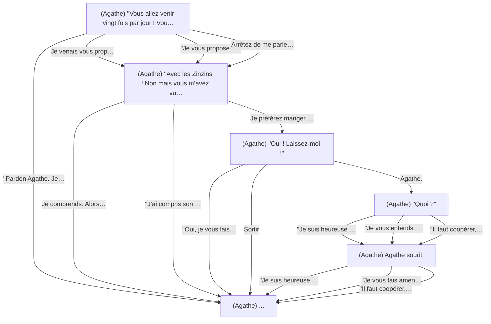
```mermaid
flowchart TD
    I1["(Agathe) ''Vous allez venir vingt fois par jour ! Vou…"]
    I2["(Agathe) ''Avec les Zinzins ! Non mais vous m’avez vu…"]
    I3["(Agathe) ''Oui ! Laissez-moi !''"]
    I4["(Agathe) ''Quoi ?''"]
    I5["(Agathe) Agathe sourit."]
    I6["(Agathe) ..."]

    I1 -->|"Je venais vous prop…"| I2
    I1 -->|"''Je vous propose d…"| I2
    I1 -->|"''Pardon Agathe. Je…"| I6
    I1 -->|"Arrêtez de me parle…"| I2
    I2 -->|"Je préférez manger …"| I3
    I2 -->|"Je comprends. Alors…"| I6
    I2 -->|"''J’ai compris son …"| I6
    I3 -->|"Agathe."| I4
    I3 -->|"''Oui, je vous lais…"| I6
    I3 -->|"Sortir"| I6
    I4 -->|"''Je suis heureuse …"| I5
    I4 -->|"''Je vous entends. …"| I5
    I4 -->|"''Il faut coopérer,…"| I5
    I5 -->|"''Je suis heureuse …"| I6
    I5 -->|"''Je vous fais amen…"| I6
    I5 -->|"''Il faut coopérer,…"| I6
```

*6 nœuds, 16 arêtes*

---

## Chapitre 2 : Vivre en EMS

### Scénario : Lieu de vie, lieu de mort

```mermaid
flowchart TD
    I1["(Claude) Je frappe à la porte d’Agathe puis entre. Ag…"]
    I2["(Agathe) ''Eh bien non, mais c'est bien normal, je ne…"]
    I3["(Agathe) 1c) Agathe d'un ton vif et rapide :''Non ! ……"]
    I4["(Agathe) ''Mais, mais, mais ces jeunes… vous n'y comp…"]
    I5["(Agathe) ''Mon mari me manque. J’aimerais le rejoindr…"]
    I6["(Agathe) ''Vous savez donc mieux que moi, ce que je v…"]
    I7["(Agathe) ''Si j'avais voulu me supprimer, je l'aurais…"]
    I8["(Agathe) ''Ceux qui ne peuvent plus se débrouiller se…"]
    I9["(Agathe) Agathe la regarde attentivement, surprise pa…"]
    I10["(Agathe) ''Il vaut mieux être sourdre que d'entendre …"]
    I11["(Agathe) ''Quand je pense à mon cousin Marcel, il est…"]
    I12["(Agathe) ''Oui et ça me fait peur !''"]
    I13["(Agathe) Agathe soupire."]
    I14["(Agathe) ''Oui !''"]
    I15["(Agathe) ''Seule nos enfants pensent que nous y somme…"]
    I16["(Agathe) Agathe reste silencieuse"]
    I17["(Agathe) Que je suis bien ici. Qu’il y a des gens qui…"]
    I18["(Agathe) Peut-être mais je ne souhaite plus en parler…"]
    I19["(Agathe) Je pense qu’ils doivent être soulagés."]
    I20["(Agathe) Ce n’était pas ce que je souhaitais, mais c’…"]
    I21["(Agathe) ''Ca va mieux ! merci Claude.''"]
    I22["(Agathe) Peut-être pas, oui."]
    I23["(Agathe) ''Oui c’est ça !''"]
    I24["(Agathe) C'est-à-dire…"]
    I25["(Agathe) ''Oh oui, je tiens absolument à le revoir av…"]
    I26["(Agathe) ''Alors à quoi bon évoquer la possibilité de…"]
    I27["(Agathe) Agathe la regarde toujours, son sourire à di…"]
    I28["(Agathe) N'en parlons plus, il y a trop d'obstacles –…"]
    I29["(Agathe) ''Vivre tranquillement, à mon rythme sans êt…"]
    I30["(Agathe) ''Alors à quoi bon me demander ce que vivre …"]
    I31["(Agathe) Agathe acquiesce d'un signe de tête, tout en…"]
    I32["(Agathe) Pas nécessairement, mais comme je n’ai plus …"]
    I33["(Agathe) Finalement nous avons des points communs mal…"]
    I34["(Agathe) Agate lui offre son plus beau sourire : Très…"]

    I1 -->|"Je m’approche du bo…"| I5
    I1 -->|"''Je suis au bord d…"| I2
    I1 -->|"Je m’appuie sur le …"| I3
    I2 -->|"Preniez-vous un tra…"| I3
    I2 -->|"Je pense que vous v…"| I3
    I2 -->|"''Je comprends. Pre…"| I3
    I3 -->|"Je reste sans voix."| I5
    I3 -->|"Je regarde fixement"| I4
    I3 -->|"''Je vous entends. …"| I5
    I4 -->|"..."| I5
    I4 -->|"''Je vous entends. …"| I5
    I4 -->|"''Il faut coopérer,…"| I5
    I5 -->|"Je la regarde"| I8
    I5 -->|"''J’ai encore de be…"| I6
    I5 -->|"Je prends une chaise"| I7
    I6 -->|"Je reste un instant…"| I8
    I6 -->|"Je hoche la tête"| I8
    I6 -->|"''Il faut coopérer,…"| I8
    I7 -->|"Je reste un instant…"| I8
    I7 -->|"Je hoche la tête"| I8
    I7 -->|"''Il faut coopérer,…"| I8
    I8 -->|"Je reste un moment"| I9
    I8 -->|"Mieux vaut mourir"| I10
    I8 -->|"On doit tous mourir…"| I10
    I9 -->|"''Excusez-moi Agath…"| I11
    I9 -->|"''Je vous entends. …"| I11
    I10 -->|"Je hoche la tête"| I12
    I10 -->|"''Est-ce que vous i…"| I12
    I10 -->|"''Il faut coopérer,…"| I12
    I11 -->|"Je lui prend la main"| I12
    I11 -->|"Je hoche la tête"| I12
    I11 -->|"''Il faut coopérer,…"| I12
    I12 -->|"Je pose sa main sur…"| I13
    I12 -->|"''Je vous entends. …"| I13
    I12 -->|"''Il faut coopérer,…"| I13
    I13 -->|"''Je vous entends s…"| I14
    I13 -->|"''Je vous entends. …"| I14
    I13 -->|"''Il faut coopérer,…"| I14
    I14 -->|"Silence de quelques…"| I16
    I14 -->|"Je regarde ailleurs…"| I15
    I14 -->|"Je l’air ailleurs"| I15
    I14 -->|"Je la regarde avec …"| I16
    I14 -->|"Je avec un sourire"| I16
    I15 -->|"Je hésite"| I16
    I15 -->|"Je dis calmement"| I17
    I15 -->|"''Il faut coopérer,…"| I16
    I16 -->|"Si je me souviens b…"| I17
    I16 -->|"Je dis calmement"| I17
    I16 -->|"''Je vous entends. …"| I17
    I17 -->|"Je lui souris légèr…"| I19
    I17 -->|"Je dis à voix haute"| I18
    I17 -->|"''Il faut coopérer,…"| I19
    I19 -->|"Je en silence laiss…"| I20
    I19 -->|"Je tout en continua…"| I21
    I19 -->|"Je lui souris"| I22
    I20 -->|"Si je peux me perme…"| I23
    I20 -->|"''Je vous entends. …"| I23
    I20 -->|"''Il faut coopérer,…"| I23
    I21 -->|"Si je peux me perme…"| I23
    I21 -->|"''Je vous entends. …"| I23
    I21 -->|"''Il faut coopérer,…"| I23
    I22 -->|"Si je peux me perme…"| I23
    I22 -->|"''Je vous entends. …"| I23
    I22 -->|"''Il faut coopérer,…"| I23
    I23 -->|"Alors, plutôt que"| I24
    I23 -->|"Je me penche"| I24
    I23 -->|"''Il faut coopérer,…"| I24
    I24 -->|"Je réfléchit"| I25
    I24 -->|"Comment voyez-vous …"| I29
    I24 -->|"''Il faut coopérer,…"| I25
    I25 -->|"J’ouvre grand les y…"| I26
    I25 -->|"J’ouvre grand les y…"| I27
    I25 -->|"''Je vous entends. …"| I26
    I26 -->|"Je reste sans répon…"| I27
    I26 -->|"Je reste sans répon…"| I28
    I26 -->|"''Je vous entends. …"| I27
    I29 -->|"Je hoche la tête"| I31
    I29 -->|"Je la regarde avec …"| I31
    I29 -->|"Je l’air désolé"| I30
    I30 -->|"Je la regarde calme…"| I31
    I30 -->|"Cela voudrait donc …"| I32
    I30 -->|"''Je vous entends. …"| I31
    I31 -->|"Si je comprends bien"| I34
    I31 -->|"Je lui souris"| I33
    I31 -->|"''Il faut coopérer,…"| I34
    I32 -->|"Si je comprends bien"| I34
    I32 -->|"Je lui souris"| I33
    I32 -->|"''Il faut coopérer,…"| I34
    I33 -->|"Je hoche positiveme…"| I34
    I33 -->|"Je sursaute"| I34
    I33 -->|"''Je fais au plus v…"| I34
```

*34 nœuds, 91 arêtes*

---

### Scénario : Projet de vie

```mermaid
flowchart TD
    I1["(Claude) ''Je suis devant la porte de la chambre d’Ag…"]
    I2["(Agathe) 'Bonjour Agathe, comment allez-vous aujourd’…"]
    I3["(Agathe) 'Bonjour Agathe, comment allez-vous aujourd’…"]
    I4["(Agathe) 'Bonjour Agathe, comment allez-vous aujourd’…"]
    I5["(Agathe) Agate soupire : … ça va, je m’ennuie un peu."]
    I6["(Agathe) Agathe secoue la tête et tourne son regard v…"]
    I7["(Agathe) Agathe la regarde en souriant et répond :''O…"]
    I8["(Agathe) Justement, avant de venir ici, je n'ai jamai…"]
    I9["(Agathe) Agathe hausse les sourcils :''Je ne suis pas…"]
    I10["(Agathe) C’est d’accord Claude."]
    I11["(Agathe) Agathe se lève et s’installe dans son lit. C…"]
    I12["(Agathe) Agathe soupire."]
    I13["(Agathe) ''Oui, avec mon diabète, vous savez j’avais …"]
    I14["(Agathe) ''Oui, que je sois amputée, avec le diabète …"]
    I15["(Agathe) Agathe attrape son drap de lit pour s’essuye…"]
    I16["(Agathe) ''Je n’y peux rien c’est ainsi''"]
    I17["(Agathe) ''Merci''"]
    I18["(Agathe) Avec plaisir, si vous ne devez pas partir po…"]
    I19["(Agathe) Agathe la regarde : Bon… il n’empêche que je…"]
    I20["(Agathe) Agathe sourit."]
    I21["(Agathe) Agathe, des étoiles dans les yeux répond :''…"]
    I22["(Agathe) Agathe les sourcils relevés, regarde Claude …"]
    I23["(Agathe) Agathe regarde face à elle, elle a l’air plo…"]
    I24["(Agathe) ''Rimbaud, Baudelaire… J’aime les mots. Vole…"]
    I25["(Agathe) ''Oh, oui, je serais ravie !''"]
    I26["(Agathe) ''Non, non, je ne souhaite déranger personne…"]
    I27["(Agathe) ''Oui j'aimeras beaucoup revoir mon petit-fi…"]
    I28["(Agathe) Agathe ajoute après quelques instants : Ecou…"]
    I29["(Agathe) ''Vous feriez ça pour moi ! Merci Claude ! D…"]
    I30["(Agathe) Agathe songeuse :''Xavier, mon petit-fils ! …"]
    I31["(Agathe) ''Je souhaiterais plus d’autonomie et … revo…"]
    I32["(Agathe) Agathe soupire et dit : je vais y songer trè…"]
    I33["(Agathe) Agathe dit d’un air décidé :''J’appellerai M…"]
    I34["(Agathe) ''Je suis obligée de prendre mes médicaments…"]
    I35["(Agathe) C'est tout ou rien, je l'ai fait jusqu'à pré…"]
    I36["(Agathe) ''De quoi avez-vous peur ?''"]
    I37["(Agathe) ''Je vous ai déjà dit que si je devais me su…"]
    I38["(Agathe) Agathe d’un ton catégorique :''Non''"]
    I39["(Agathe) Agathe à l’air satisfaite, elle sourit et di…"]
    I40["(Agathe) Agathe semble un peu hésitante mais ne répon…"]
    I41["(Agathe) Avec plaisir Claude"]
    I42["(Agathe) Il me semble oui."]
    I43["(Agathe) Ma foi je ne sais pas si je me souviens de t…"]
    I44["(Agathe) Agathe ne cesse plus de sourire :''Oui Claud…"]
    I45["(Agathe) ''Oui merci Claude. Au revoir ! Bonne journé…"]
    I46["(Agathe) ''Oui Claude''"]

    I1 -->|"Elle prend un temps…"| I3
    I1 -->|"Elle prend un temps…"| I3
    I1 -->|"Elle frappe et entr…"| I2
    I1 -->|"Elle entre"| I4
    I2 -->|"Je l’air désolé"| I5
    I2 -->|"''Il faut coopérer,…"| I5
    I2 -->|"''Je vous entends. …"| I5
    I3 -->|"Je me pince les lèv…"| I5
    I3 -->|"''Il faut coopérer,…"| I5
    I3 -->|"''Je vous entends. …"| I5
    I4 -->|"Je regarde en l’air"| I5
    I4 -->|"''Je vous entends. …"| I5
    I4 -->|"''Il faut coopérer,…"| I5
    I5 -->|"Je la regarde avec …"| I10
    I5 -->|"Je pousse le chariot"| I8
    I5 -->|"Je acquiesce"| I8
    I5 -->|"Je en la regardant"| I10
    I5 -->|"Je étonnée"| I9
    I5 -->|"Je lui dis"| I6
    I7 -->|"Qu'aimiez -vous don…"| I8
    I7 -->|"Je lui rend"| I8
    I7 -->|"''Il faut coopérer,…"| I8
    I8 -->|"Je la regarde"| I10
    I8 -->|"''Je vous entends. …"| I10
    I8 -->|"''Il faut coopérer,…"| I10
    I10 -->|"Bien, est-ce que vo…"| I11
    I10 -->|"Bien, pour cela"| I11
    I10 -->|"''Il faut coopérer,…"| I11
    I11 -->|"..."| I12
    I11 -->|"''Je vous entends. …"| I12
    I11 -->|"''Il faut coopérer,…"| I12
    I12 -->|"''Je suis soulagée.…"| I13
    I12 -->|"Quel soupire !"| I13
    I12 -->|"Je pensiez que la p…"| I13
    I13 -->|"Je aviez très peur."| I15
    I13 -->|"Comment peur ?"| I14
    I13 -->|"Je regarde un insta…"| I15
    I14 -->|"..."| I15
    I14 -->|"''Je vous entends. …"| I15
    I14 -->|"''Il faut coopérer,…"| I15
    I15 -->|"Je lui tend un mouc…"| I17
    I15 -->|"Je lui frotte"| I16
    I15 -->|"Je lui prend la main"| I17
    I16 -->|"Je lui souris"| I18
    I16 -->|"Je attend qu’Agathe"| I20
    I16 -->|"''Il faut coopérer,…"| I18
    I17 -->|"Je lui souris"| I18
    I17 -->|"Je attend qu’Agathe"| I20
    I17 -->|"''Il faut coopérer,…"| I18
    I18 -->|"Je sourit et dit"| I19
    I18 -->|"Je baisse"| I19
    I18 -->|"''Il faut coopérer,…"| I19
    I19 -->|"Alors dites-moi tou…"| I23
    I19 -->|"''Je vous entends. …"| I23
    I19 -->|"''Il faut coopérer,…"| I23
    I20 -->|"''Je vous vois sour…"| I21
    I20 -->|"C’est bon de vous v…"| I21
    I20 -->|"''Il faut coopérer,…"| I21
    I21 -->|"''Qu’est-ce qui vou…"| I23
    I21 -->|"''Oui c'est juste, …"| I23
    I21 -->|"C'est vraiment bien…"| I23
    I21 -->|"Mais que diraient v…"| I22
    I23 -->|"Je lui souris"| I24
    I23 -->|"Je l’écoute"| I25
    I23 -->|"''Il faut coopérer,…"| I24
    I24 -->|"Je hoche la tête"| I25
    I24 -->|"Je lui souris"| I25
    I24 -->|"''Il faut coopérer,…"| I25
    I25 -->|"Alors je vais en pa…"| I29
    I25 -->|"Je lui souris"| I26
    I25 -->|"Pourrions-nous prop…"| I26
    I26 -->|"Sinon, est-ce que d…"| I27
    I26 -->|"Autre chose peut êt…"| I27
    I26 -->|"''Il faut coopérer,…"| I27
    I27 -->|"''J’ai l’air un peu…"| I28
    I27 -->|"''Je vous entends. …"| I28
    I27 -->|"''Il faut coopérer,…"| I28
    I29 -->|"Je la regarde"| I30
    I29 -->|"Hormis la lecture"| I31
    I29 -->|"''Il faut coopérer,…"| I30
    I30 -->|"Dans ce cas vous sa…"| I32
    I30 -->|"Je lui prend la main"| I33
    I30 -->|"''Il faut coopérer,…"| I32
    I31 -->|"Dans ce cas vous sa…"| I32
    I31 -->|"Je lui prend la main"| I33
    I31 -->|"''Il faut coopérer,…"| I32
    I32 -->|"..."| I34
    I32 -->|"''Je vois que ce su…"| I34
    I32 -->|"''Je vais respecter…"| I34
    I33 -->|"..."| I34
    I33 -->|"''Je vous entends. …"| I34
    I33 -->|"''Il faut coopérer,…"| I34
    I34 -->|"C'est une idée Agat…"| I35
    I34 -->|"Il est difficile"| I36
    I34 -->|"Je pourriez peut-êt…"| I37
    I34 -->|"Dans un home"| I38
    I35 -->|"Je lui pose"| I39
    I35 -->|"''Il faut coopérer,…"| I39
    I35 -->|"''Je vous entends. …"| I39
    I36 -->|"Voyez, parfois que …"| I39
    I36 -->|"''Je vous entends. …"| I39
    I36 -->|"''Il faut coopérer,…"| I39
    I37 -->|"Je lui pose la main"| I39
    I37 -->|"''Il faut coopérer,…"| I39
    I37 -->|"''Je vous entends. …"| I39
    I38 -->|"Je lui pose la main"| I39
    I38 -->|"''Il faut coopérer,…"| I39
    I38 -->|"''Je vous entends. …"| I39
    I39 -->|"Avant de vous quitt…"| I41
    I39 -->|"Autre chose,"| I41
    I39 -->|"À propos,"| I40
    I40 -->|"Pensez-vous"| I42
    I40 -->|"Pourriez-vous"| I43
    I40 -->|"''Il faut coopérer,…"| I42
    I41 -->|"Pensez-vous"| I42
    I41 -->|"Pourriez-vous résum…"| I43
    I41 -->|"''Il faut coopérer,…"| I42
    I42 -->|"Donc Agathe,"| I44
    I42 -->|"''Je vous entends. …"| I44
    I42 -->|"''Il faut coopérer,…"| I44
    I43 -->|"Donc si je résume"| I46
    I43 -->|"''Je vous entends. …"| I46
    I43 -->|"''Il faut coopérer,…"| I46
    I44 -->|"Alors je vous laisse"| I45
    I44 -->|"''Je vous entends. …"| I45
    I44 -->|"''Il faut coopérer,…"| I45
    I46 -->|"Alors je vous laiss…"| I45
    I46 -->|"''Je vous entends. …"| I45
    I46 -->|"''Il faut coopérer,…"| I45
```

*46 nœuds, 129 arêtes*

---

### Scénario : Culpabilité des proches

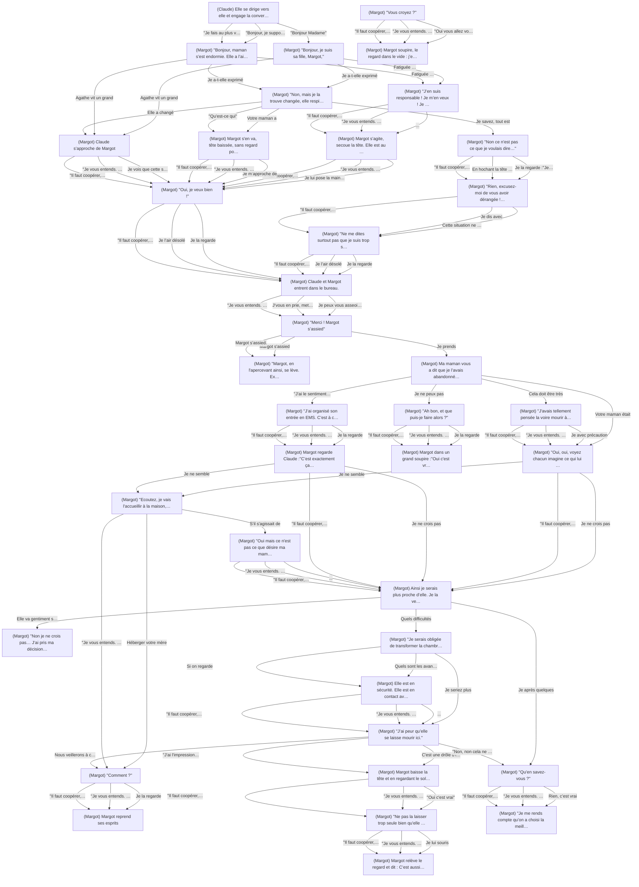
```mermaid
flowchart TD
    I1["(Claude) Elle se dirige vers elle et engage la conver…"]
    I2["(Margot) ''Bonjour, je suis sa fille, Margot,''"]
    I3["(Margot) ''Bonjour, maman s’est endormie. Elle a l’ai…"]
    I4["(Margot) ''Non, mais je la trouve changée, elle respi…"]
    I5["(Margot) ''J’en suis responsable ! Je m’en veux ! Je …"]
    I6["(Margot) Margot s’agite, secoue la tête. Elle est au …"]
    I7["(Margot) Margot s'en va, tête baissée, sans regard po…"]
    I8["(Margot) ''Non ce n'est pas ce que je voulais dire…''"]
    I9["(Margot) ''Rien, excusez-moi de vous avoir dérangée !…"]
    I10["(Margot) ''Ne me dites surtout pas que je suis trop s…"]
    I11["(Margot) ''Oui, je veux bien !''"]
    I12["(Margot) Claude et Margot entrent dans le bureau."]
    I13["(Margot) ''Merci ! Margot s’assied''"]
    I14["(Margot) ''Margot, en l'apercevant ainsi, se lève. Ex…"]
    I15["(Margot) Ma maman vous a dit que je l’avais abandonné…"]
    I16["(Margot) ''J’ai organisé son entrée en EMS. C’est à c…"]
    I17["(Margot) ''J'avais tellement pensée la voire mourir à…"]
    I18["(Margot) ''Oui, oui, voyez chacun imagine ce qui lui …"]
    I19["(Margot) ''Ah bon, et que puis-je faire alors ?''"]
    I20["(Margot) Margot dans un grand soupire :''Oui c'est vr…"]
    I21["(Margot) ''Vous croyez ?''"]
    I22["(Margot) Margot soupire, le regard dans le vide : j’e…"]
    I23["(Margot) Margot regarde Claude :''C’est exactement ça…"]
    I24["(Margot) ''Ecoutez, je vais l'accueillir à la maison,…"]
    I25["(Margot) ''Oui mais ce n'est pas ce que désire ma mam…"]
    I26["(Margot) Ainsi je serais plus proche d’elle. Je la ve…"]
    I27["(Margot) ''Non je ne crois pas… J’ai pris ma décision…"]
    I28["(Margot) ''Je serais obligée de transformer la chambr…"]
    I29["(Margot) Elle est en sécurité. Elle est en contact av…"]
    I30["(Margot) ''Comment ?''"]
    I31["(Margot) Margot reprend ses esprits"]
    I32["(Margot) ''Qu'en savez-vous ?''"]
    I33["(Margot) Margot baisse la tête et en regardant le sol…"]
    I34["(Margot) ''Ne pas la laisser trop seule bien qu'elle …"]
    I35["(Margot) Margot relève le regard et dit : C’est aussi…"]
    I36["(Margot) ''Je me rends compte qu’on a choisi la meill…"]
    I37["(Margot) Claude s’approche de Margot"]
    I38["(Margot) ''J’ai peur qu’elle se laisse mourir ici.''"]

    I1 -->|"''Bonjour, je suppo…"| I3
    I1 -->|"''Bonjour Madame''"| I2
    I1 -->|"''Je fais au plus v…"| I3
    I2 -->|"Agathe vit un grand"| I37
    I2 -->|"Fatiguée …"| I5
    I2 -->|"Je a-t-elle exprimé"| I4
    I3 -->|"Agathe vit un grand"| I37
    I3 -->|"Fatiguée …"| I5
    I3 -->|"Je a-t-elle exprimé"| I4
    I4 -->|"Elle a changé"| I37
    I4 -->|"Je savez, tout est"| I8
    I4 -->|"Votre maman a"| I7
    I4 -->|"''Qu'est-ce qui''"| I7
    I5 -->|"..."| I6
    I5 -->|"''Je vous entends. …"| I6
    I5 -->|"''Il faut coopérer,…"| I6
    I6 -->|"Je lui pose la main…"| I11
    I6 -->|"''Je vous entends. …"| I11
    I6 -->|"''Il faut coopérer,…"| I11
    I7 -->|"Je m’approche de"| I11
    I7 -->|"''Je vous entends. …"| I11
    I7 -->|"''Il faut coopérer,…"| I11
    I8 -->|"Je la regarde :''Je…"| I9
    I8 -->|"En hochant la tête …"| I9
    I8 -->|"''Il faut coopérer,…"| I9
    I9 -->|"Cette situation ne …"| I10
    I9 -->|"Je dis avec"| I10
    I9 -->|"''Il faut coopérer,…"| I10
    I10 -->|"Je la regarde"| I12
    I10 -->|"Je l’air désolé"| I12
    I10 -->|"''Il faut coopérer,…"| I12
    I11 -->|"Je la regarde"| I12
    I11 -->|"Je l’air désolé"| I12
    I11 -->|"''Il faut coopérer,…"| I12
    I12 -->|"Je peux vous asseoi…"| I13
    I12 -->|"J’vous en prie, met…"| I13
    I12 -->|"''Je vous entends. …"| I13
    I13 -->|"Je prends"| I15
    I13 -->|"Margot s'assied"| I14
    I13 -->|"Margot s’assied."| I14
    I15 -->|"''J’ai le sentiment…"| I16
    I15 -->|"Cela doit être très"| I17
    I15 -->|"Je ne peux pas"| I19
    I15 -->|"Votre maman était"| I18
    I16 -->|"Je la regarde"| I23
    I16 -->|"''Je vous entends. …"| I23
    I16 -->|"''Il faut coopérer,…"| I23
    I17 -->|"Je avec précaution"| I18
    I17 -->|"''Je vous entends. …"| I18
    I17 -->|"''Il faut coopérer,…"| I18
    I18 -->|"Je ne crois pas"| I26
    I18 -->|"Je ne semble"| I24
    I18 -->|"''Il faut coopérer,…"| I26
    I19 -->|"Je la regarde"| I20
    I19 -->|"''Je vous entends. …"| I20
    I19 -->|"''Il faut coopérer,…"| I20
    I21 -->|"''Oui vous allez vo…"| I22
    I21 -->|"''Je vous entends. …"| I22
    I21 -->|"''Il faut coopérer,…"| I22
    I23 -->|"Je ne crois pas"| I26
    I23 -->|"Je ne semble"| I24
    I23 -->|"''Il faut coopérer,…"| I26
    I24 -->|"Héberger votre mère"| I30
    I24 -->|"S’il s'agissait de"| I25
    I24 -->|"''Je vous entends. …"| I30
    I25 -->|"..."| I26
    I25 -->|"''Je vous entends. …"| I26
    I25 -->|"''Il faut coopérer,…"| I26
    I26 -->|"Quels difficultés"| I28
    I26 -->|"Je après quelques"| I32
    I26 -->|"Elle va gentiment s…"| I27
    I28 -->|"Quels sont les avan…"| I29
    I28 -->|"Je seriez plus"| I38
    I28 -->|"Si on regarde"| I29
    I29 -->|"..."| I38
    I29 -->|"''Je vous entends. …"| I38
    I29 -->|"''Il faut coopérer,…"| I38
    I30 -->|"Je la regarde"| I31
    I30 -->|"''Je vous entends. …"| I31
    I30 -->|"''Il faut coopérer,…"| I31
    I32 -->|"Rien, c’est vrai"| I36
    I32 -->|"''Je vous entends. …"| I36
    I32 -->|"''Il faut coopérer,…"| I36
    I33 -->|"''Oui c'est vrai''"| I34
    I33 -->|"''Je vous entends. …"| I34
    I33 -->|"''Il faut coopérer,…"| I34
    I34 -->|"Je lui souris"| I35
    I34 -->|"''Je vous entends. …"| I35
    I34 -->|"''Il faut coopérer,…"| I35
    I37 -->|"Je vois que cette s…"| I11
    I37 -->|"''Je vous entends. …"| I11
    I37 -->|"''Il faut coopérer,…"| I11
    I38 -->|"Nous veillerons à c…"| I30
    I38 -->|"C'est une drôle d'i…"| I33
    I38 -->|"''Non, non cela ne …"| I32
    I38 -->|"''J’ai l'impression…"| I33
```

*38 nœuds, 96 arêtes*

---

## Chapitre 3 : Représentations individuelles et collectives de la fin de vie.

### Scénario : Angoisse de la dyspnée

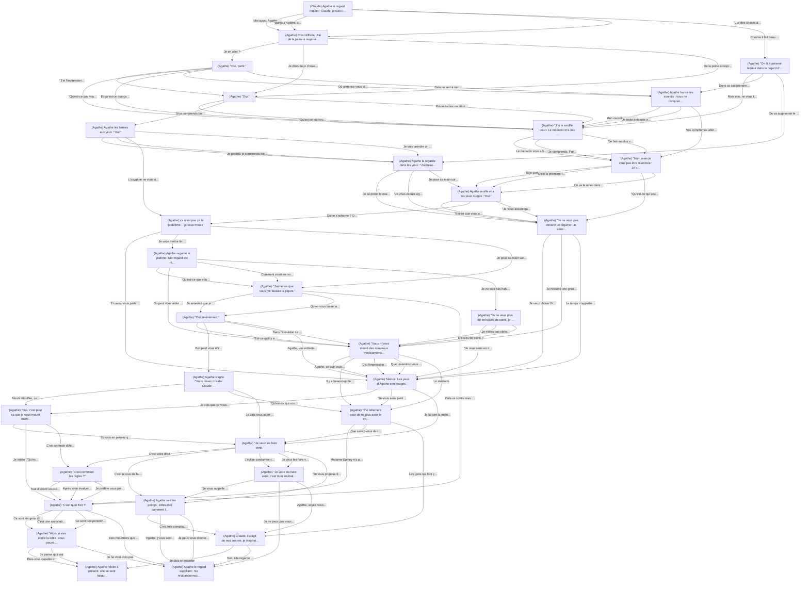
```mermaid
flowchart TD
    I1["(Claude) Agathe le regard inquiet : Claude, je suis c…"]
    I2["(Agathe) C’est difficile. J’ai de la peine à respirer…"]
    I3["(Agathe) ''On lit à présent la peur dans le regard d’…"]
    I4["(Agathe) ''Oui, partir.''"]
    I5["(Agathe) ''Oui.''"]
    I6["(Agathe) Agathe fronce les sourcils : vous ne compren…"]
    I7["(Agathe) ''J’ai le souffle court. Le médecin m’a mis …"]
    I8["(Agathe) Agathe les larmes aux yeux :''Oui''"]
    I9["(Agathe) ''Non, mais je veux pas être réanimée ! Je v…"]
    I10["(Agathe) Agathe la regarde dans les yeux :''J’ai beso…"]
    I11["(Agathe) Agathe renifle et a les yeux rouges :''Oui.''"]
    I12["(Agathe) ''Je ne veux pas devenir un légume ! Je veux…"]
    I13["(Agathe) ça n’est pas ça le problème… je veux mourir …"]
    I14["(Agathe) Agathe regarde le plafond. Son regard est ré…"]
    I15["(Agathe) ''J’aimerais que vous me fassiez la piqure.''"]
    I16["(Agathe) ''Je ne veux plus de cet excès de soins, je …"]
    I17["(Agathe) ''Oui, maintenant.''"]
    I18["(Agathe) ''Vous m’avez donné des nouveaux médicaments…"]
    I19["(Agathe) Silence. Les yeux d’Agathe sont rouges."]
    I20["(Agathe) Agathe s’agite :''Vous devez m’aider Claude …"]
    I21["(Agathe) ''Oui, c’est pour ça que je veux mourir main…"]
    I22["(Agathe) ''J’ai tellement peur de ne plus avoir le ch…"]
    I23["(Agathe) ''Je veux les faire venir.''"]
    I24["(Agathe) ''C’est comment les règles ?''"]
    I25["(Agathe) ''Je veux les faire venir, c’est mon souhait…"]
    I26["(Agathe) Agathe sert les poings : Dites-moi comment l…"]
    I27["(Agathe) ''C’est quoi Exit ?''"]
    I28["(Agathe) ''Alors je vais écrire la lettre, vous pouve…"]
    I29["(Agathe) Claude, il s’agit de moi, ma vie, je voudrai…"]
    I30["(Agathe) Agathe hésite à présent, elle se sent fatigu…"]
    I31["(Agathe) Agathe le regard suppliant : Ne m’abandonnez…"]

    I1 -->|"Moi aussi, Agathe, …"| I2
    I1 -->|"''Bonjour Agathe, c…"| I2
    I1 -->|"''J’ai des choses à…"| I2
    I1 -->|"Comme il fait beau …"| I3
    I2 -->|"Je en aller ?"| I4
    I2 -->|"Je dites deux chose…"| I5
    I2 -->|"De la peine à respi…"| I5
    I3 -->|"Mais non, ne vous f…"| I7
    I3 -->|"Dans ce cas prendre…"| I6
    I3 -->|"On va augmenter le …"| I10
    I4 -->|"''J’ai l’impression…"| I5
    I4 -->|"''Qu’est-ce que vou…"| I7
    I4 -->|"Et qu’est-ce que ça…"| I7
    I4 -->|"Où aimeriez-vous al…"| I6
    I4 -->|"Cela ne sert à rien…"| I6
    I5 -->|"''Qu’est-ce qui vou…"| I7
    I5 -->|"Si je comprends bie…"| I8
    I5 -->|"Pouvez-vous me décr…"| I7
    I6 -->|"Bon racontez moi ce…"| I7
    I6 -->|"Je reste présente e…"| I7
    I6 -->|"Vos symptômes altèr…"| I9
    I7 -->|"Le médecin vous a b…"| I9
    I7 -->|"''Je comprends. Pre…"| I9
    I7 -->|"''Je fais au plus v…"| I9
    I8 -->|"Je perdez pied ?"| I10
    I8 -->|"Si je comprends bie…"| I10
    I8 -->|"L’oxygène ne vous a…"| I13
    I8 -->|"Je vais prendre un …"| I10
    I9 -->|"Si je comprends bie…"| I11
    I9 -->|"C’est la première f…"| I11
    I9 -->|"''Qu’est-ce qui vou…"| I12
    I9 -->|"On va le noter dans…"| I11
    I10 -->|"Je lui prend la mai…"| I12
    I10 -->|"''Je vous écoute Ag…"| I12
    I10 -->|"Je pose sa main sur…"| I11
    I11 -->|"''Est-ce que vous a…"| I12
    I11 -->|"Qu’on s’acharne ? Q…"| I13
    I11 -->|"''Je vous assure qu…"| I12
    I12 -->|"Je veux choisir l’h…"| I19
    I12 -->|"Je ressens une gran…"| I18
    I12 -->|"Le temps n’appartie…"| I19
    I13 -->|"En avez-vous parlé …"| I19
    I13 -->|"Je veux mettre fin …"| I14
    I13 -->|"Je pose sa main sur…"| I15
    I14 -->|"''Qu’est-ce que vou…"| I15
    I14 -->|"On peut vous aider …"| I18
    I14 -->|"Comment voudriez-vo…"| I15
    I14 -->|"Je ne suis pas habi…"| I16
    I15 -->|"Je aimeriez que je …"| I17
    I15 -->|"Qu’on vous fasse la…"| I17
    I15 -->|"Cela va contre mes …"| I27
    I16 -->|"''Je vous sens en d…"| I19
    I16 -->|"Je n’êtes pas série…"| I18
    I16 -->|"D’excès de soins ?"| I18
    I17 -->|"''Est-ce qu’il y a …"| I18
    I17 -->|"Exit peut vous offr…"| I20
    I17 -->|"Dans l’immédiat ce …"| I18
    I17 -->|"Agathe, vos enfants…"| I19
    I18 -->|"Agathe, ce que vous…"| I19
    I18 -->|"Il y a beaucoup de …"| I22
    I18 -->|"''J’ai l’impression…"| I19
    I18 -->|"Que ressentez-vous …"| I19
    I18 -->|"Le médecin"| I22
    I19 -->|"Je vois que ça vous…"| I21
    I19 -->|"''Je vous sens perd…"| I22
    I19 -->|"Je lui sert la main…"| I23
    I20 -->|"Mourir étouffée, ce…"| I21
    I20 -->|"''Qu’est-ce qui vou…"| I22
    I20 -->|"Je vais vous aider …"| I23
    I21 -->|"Et vous en pensez q…"| I23
    I21 -->|"Je irritée :''Qu’es…"| I27
    I21 -->|"C’est normale d’êtr…"| I24
    I22 -->|"Madame Epiney n’a p…"| I27
    I22 -->|"Que savez-vous de c…"| I23
    I22 -->|"Les gens qui font ç…"| I29
    I23 -->|"C’est votre droit."| I24
    I23 -->|"C’est à vous de fai…"| I26
    I23 -->|"L’église condamne c…"| I25
    I23 -->|"Je veux les faire v…"| I25
    I23 -->|"''Je vous propose d…"| I26
    I24 -->|"Tout d’abord vous d…"| I27
    I24 -->|"Après avoir évaluer…"| I27
    I24 -->|"Je préfère vous pré…"| I27
    I25 -->|"''Je vous rappelle …"| I26
    I25 -->|"Je ne peux pas vous…"| I31
    I25 -->|"Agathe, soyez raiso…"| I29
    I26 -->|"C’est très compliqu…"| I29
    I26 -->|"Agathe, j’vous sent…"| I31
    I26 -->|"Je peux vous donner…"| I31
    I27 -->|"Ce sont les gens do…"| I28
    I27 -->|"C’est une associati…"| I28
    I27 -->|"Ce sont des personn…"| I28
    I27 -->|"Des meurtriers que …"| I31
    I28 -->|"Êtes-vous capable d…"| I30
    I28 -->|"Je pense qu’il est"| I30
    I28 -->|"Je ne vous vois pas"| I31
    I29 -->|"Je dois en reparler"| I30
    I29 -->|"Soit, elle regarde …"| I31
```

*31 nœuds, 98 arêtes*

---

### Scénario : Les dernières volontés

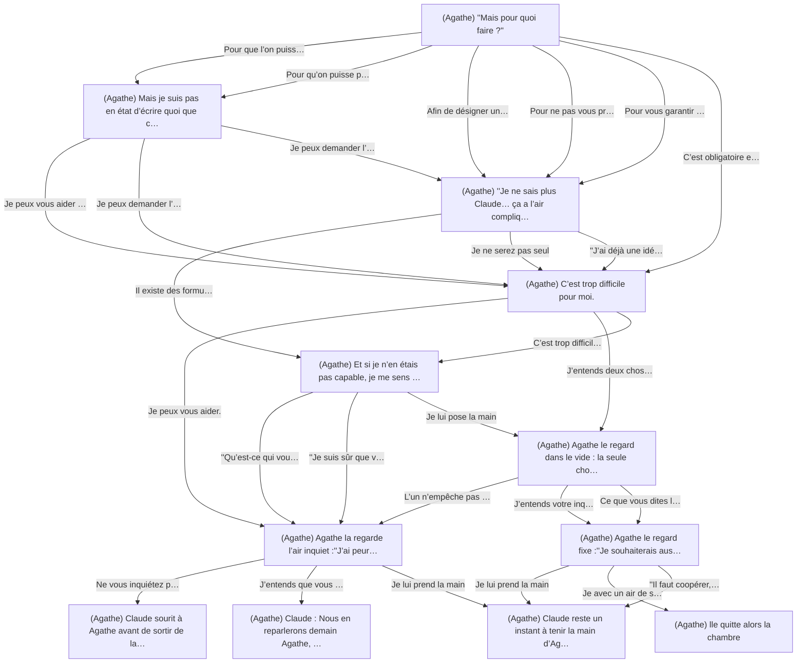
```mermaid
flowchart TD
    I1["(Agathe) ''Mais pour quoi faire ?''"]
    I2["(Agathe) Mais je suis pas en état d’écrire quoi que c…"]
    I3["(Agathe) ''Je ne sais plus Claude… ça a l’air compliq…"]
    I4["(Agathe) C’est trop difficile pour moi."]
    I5["(Agathe) Et si je n’en étais pas capable, je me sens …"]
    I6["(Agathe) Agathe le regard dans le vide : la seule cho…"]
    I7["(Agathe) Agathe la regarde l’air inquiet :''J’ai peur…"]
    I8["(Agathe) Agathe le regard fixe :''Je souhaiterais aus…"]
    I9["(Agathe) Claude reste un instant à tenir la main d’Ag…"]
    I10["(Agathe) Claude sourit à Agathe avant de sortir de la…"]
    I11["(Agathe) Claude : Nous en reparlerons demain Agathe, …"]
    I12["(Agathe) lle quitte alors la chambre"]

    I1 -->|"Pour que l’on puiss…"| I2
    I1 -->|"Pour qu’on puisse p…"| I2
    I1 -->|"Afin de désigner un…"| I3
    I1 -->|"Pour ne pas vous pr…"| I3
    I1 -->|"Pour vous garantir …"| I3
    I1 -->|"C’est obligatoire e…"| I4
    I2 -->|"Je peux vous aider …"| I4
    I2 -->|"Je peux demander l’…"| I4
    I2 -->|"Je peux demander l’…"| I3
    I3 -->|"Il existe des formu…"| I5
    I3 -->|"Je ne serez pas seul"| I4
    I3 -->|"''J’ai déjà une idé…"| I4
    I4 -->|"Je peux vous aider."| I7
    I4 -->|"J’entends deux chos…"| I6
    I4 -->|"C’est trop difficil…"| I5
    I5 -->|"''Qu’est-ce qui vou…"| I7
    I5 -->|"''Je suis sûr que v…"| I7
    I5 -->|"Je lui pose la main"| I6
    I6 -->|"L’un n’empêche pas …"| I7
    I6 -->|"J’entends votre inq…"| I8
    I6 -->|"Ce que vous dites l…"| I8
    I7 -->|"Ne vous inquiétez p…"| I10
    I7 -->|"J’entends que vous …"| I11
    I7 -->|"Je lui prend la main"| I9
    I8 -->|"Je lui prend la main"| I9
    I8 -->|"Je avec un air de s…"| I12
    I8 -->|"''Il faut coopérer,…"| I9
```

*12 nœuds, 27 arêtes*

---

### Scénario : Les professionnels face à la mort

```mermaid
flowchart TD
    I1["(Pascal) Salut Claude. Je sors d’une séance avec la d…"]
    I2["(Pascal) ''Oui, seulement dix car j’ai à faire. Pasca…"]
    I3["(Pascal) ''Oui, elle n’a pas changé. Tu as bien fait.…"]
    I4["(Pascal) <i>(Valeurs :''Rappel du code déontologique,…"]
    I5["(Pascal) ''Oui, mais là elle ne veut plus être soigné…"]
    I6["(Pascal) ''Tu lui as proposé de la soulager ?''"]
    I7["(Pascal) <i>(Autodétermination : Rappel)</i> Agathe e…"]
    I8["(Pascal) Encore une fois tu n’es pas responsable de s…"]
    I9["(Pascal) Nos clients meurent ici que tu le veuilles o…"]
    I10["(Pascal) Bien sûr, mais cela touche une minorité de c…"]
    I11["(Pascal) ''Non, surtout pas.''"]
    I12["(Pascal) ''Oui, tu peux par contre soutenir Agathe da…"]
    I13["(Pascal) Il ne s’agit pas de toi, mais d’Agathe."]
    I14["(Pascal) Là, je trouve que tu exagères. Et en plus le…"]
    I15["(Pascal) ''Je t’en prie.''"]

    I1 -->|"C’est une bonne nou…"| I2
    I1 -->|"''D’accord. J’aimer…"| I2
    I1 -->|"''Ce n’est pas mon …"| I2
    I2 -->|"Je ne me sens pas t…"| I3
    I2 -->|"Je frappe doucement…"| I3
    I2 -->|"J’entre rapidement,…"| I3
    I3 -->|"''Je suis soulagée …"| I4
    I3 -->|"''D’accord. J’aimer…"| I4
    I3 -->|"''Ce n’est pas mon …"| I4
    I4 -->|"''Je suis très emba…"| I5
    I4 -->|"''D’accord. J’aimer…"| I5
    I4 -->|"''Ce n’est pas mon …"| I5
    I5 -->|"Pascal, j’ai l’impr…"| I6
    I5 -->|"''D’accord. J’aimer…"| I6
    I5 -->|"''Ce n’est pas mon …"| I6
    I6 -->|"''Oui, bien sûr !''"| I7
    I6 -->|"''D’accord. J’aimer…"| I7
    I6 -->|"''Ce n’est pas mon …"| I7
    I7 -->|"Je sais tout ça."| I8
    I7 -->|"''D’accord. J’aimer…"| I8
    I7 -->|"''Ce n’est pas mon …"| I8
    I8 -->|"Mais enfin Pascal,"| I9
    I8 -->|"''D’accord. J’aimer…"| I9
    I8 -->|"''Ce n’est pas mon …"| I9
    I9 -->|"Je sais bien."| I10
    I9 -->|"''D’accord. J’aimer…"| I10
    I9 -->|"''Ce n’est pas mon …"| I10
    I10 -->|"''Est-ce qu’il n’y …"| I11
    I10 -->|"''D’accord. J’aimer…"| I11
    I10 -->|"''Ce n’est pas mon …"| I11
    I11 -->|"Ce choix lui appart…"| I12
    I11 -->|"''D’accord. J’aimer…"| I12
    I11 -->|"''Ce n’est pas mon …"| I12
    I12 -->|"Mais enfin Pascal. …"| I13
    I12 -->|"''D’accord. J’aimer…"| I13
    I12 -->|"''Ce n’est pas mon …"| I13
    I13 -->|"Ce temps de vie d’A…"| I14
    I13 -->|"''D’accord. J’aimer…"| I14
    I13 -->|"''Ce n’est pas mon …"| I14
    I14 -->|"Je dois commencer"| I15
    I14 -->|"''D’accord. J’aimer…"| I15
    I14 -->|"''Ce n’est pas mon …"| I15
```

*15 nœuds, 42 arêtes*

---

### Scénario : Acceptation inconditionnelle

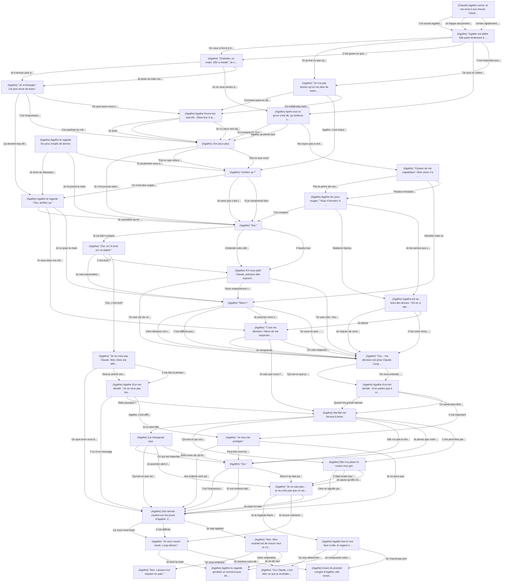
```mermaid
flowchart TD
    I1["(Claude) Agathe sonne. je me rend à son chevet. Claud…"]
    I2["(Agathe) ''Agathe est alitée. Elle parle lentement à …"]
    I3["(Agathe) ''Charlotte, ce matin. Elle a insisté ! Je n…"]
    I4["(Agathe) ''Je n’ai pas besoin qu’on me dise de boire,…"]
    I5["(Agathe) Après tout ce qu’on s’est dit, ça renforce c…"]
    I6["(Agathe) ''Je m’étrangle ! J’ai plus envie de boire.''"]
    I7["(Agathe) Agathe fronce les sourcils : Dites-leur à to…"]
    I8["(Agathe) J’en peux plus"]
    I9["(Agathe) Agathe la regarde les yeux emplis de larmes …"]
    I10["(Agathe) ''Arrêtez ça !''"]
    I11["(Agathe) ''Cessez de me culpabiliser ! Mon choix n’a …"]
    I12["(Agathe) Agathe la regarde :''Oui, arrêtez ça.''"]
    I13["(Agathe) Agathe les yeux rouges :''Vous n’écoutez ni …"]
    I14["(Agathe) ''Oui.''"]
    I15["(Agathe) Agathe est au bord des larmes :''On en a par…"]
    I16["(Agathe) ''Oui, on l’a écrit sur un papier.''"]
    I17["(Agathe) S’il vous plaît Claude, précisez dès aujourd…"]
    I18["(Agathe) ''Merci !''"]
    I19["(Agathe) ''C’est ma décision ! Merci de me respecter.…"]
    I20["(Agathe) ''Oui... ma décision est prise Claude. Long …"]
    I21["(Agathe) ''Je ne crois pas Claude. Mon choix est défi…"]
    I22["(Agathe) Agathe d’un ton décidé : N’en parlez pas à m…"]
    I23["(Agathe) Agathe d’un ton décidé :''Je ne veux pas les…"]
    I24["(Agathe) Ma fille me forcera à boire."]
    I25["(Agathe) ''Je veux les protéger.''"]
    I26["(Agathe) Ça changerait tout."]
    I27["(Agathe) Elle m’a placé ici contre mon gré."]
    I28["(Agathe) ''Oui.''"]
    I29["(Agathe) ''Je ne sais pas… je ne crois pas que ce soi…"]
    I30["(Agathe) Des larmes coulent sur les joues d’Agathe. C…"]
    I31["(Agathe) Agathe fixe le mur face à elle, le regard vi…"]
    I32["(Agathe) ''Je veux mourir seule. Long silence.''"]
    I33["(Agathe) ''Non. Mon souhait est de mourir seul et c’e…"]
    I34["(Agathe) ''Non. Laissez-moi reposer en paix.''"]
    I35["(Agathe) ''Oui Claude, c’est bien ce que je souhaite,…"]
    I36["(Agathe) Agathe la regarde pendant un moment puis fer…"]
    I37["(Agathe) Avant de prendre congés d’Agathe, elle remet…"]

    I1 -->|"''J’ai sonné Agathe…"| I2
    I1 -->|"Je frappe doucement…"| I2
    I1 -->|"J’entre rapidement,…"| I2
    I2 -->|"On vous a forcé à b…"| I3
    I2 -->|"Et qu’est-ce que ça…"| I4
    I2 -->|"C’est grave ce que …"| I3
    I2 -->|"''Je suis en colère…"| I5
    I2 -->|"C’est important pou…"| I4
    I3 -->|"Je n’arrivez plus à…"| I6
    I3 -->|"Je ne vous sentez p…"| I5
    I3 -->|"Je pose sa main sur…"| I6
    I4 -->|"Comment peut-on fai…"| I7
    I4 -->|"Agathe, c’est impor…"| I10
    I4 -->|"Ce n’était pas cont…"| I7
    I5 -->|"Si j’comprends bien…"| I8
    I5 -->|"Agathe, je pense que"| I8
    I5 -->|"Ne soyez pas si ent…"| I11
    I6 -->|"Ça devient trop dif…"| I12
    I6 -->|"''J’ai l’impression…"| I8
    I6 -->|"De quoi avez-vous e…"| I7
    I7 -->|"J’en parlerai au mé…"| I8
    I7 -->|"Je pose"| I8
    I7 -->|"Je n’y peux rien Ag…"| I8
    I8 -->|"Je n’en pouvez plus…"| I14
    I8 -->|"''Est-ce que cela p…"| I10
    I8 -->|"''Est-ce que vous''"| I10
    I9 -->|"Je sens du désespoi…"| I12
    I9 -->|"Je lui prend la main"| I14
    I9 -->|"Si seulement vous a…"| I10
    I10 -->|"Ce n’est plus suppo…"| I12
    I10 -->|"Je sens que c’est t…"| I14
    I10 -->|"Si je comprends bien"| I14
    I11 -->|"Pas la peine de vou…"| I13
    I11 -->|"Désolée mais ce"| I18
    I11 -->|"''Pardon d’insister…"| I13
    I12 -->|"Je souhaitez qu’on …"| I14
    I12 -->|"Si vous étiez ma mè…"| I19
    I12 -->|"Je lui pose la main"| I18
    I13 -->|"''J’ai compris''"| I14
    I13 -->|"Madame Epiney"| I15
    I13 -->|"Je les larmes aux y…"| I15
    I14 -->|"Si j’ai bien compris"| I16
    I14 -->|"J’entends votre dét…"| I17
    I14 -->|"Il faudra tout"| I17
    I15 -->|"Je risquez de vivre…"| I20
    I15 -->|"C’est votre choix. …"| I20
    I15 -->|"Je pleure"| I19
    I16 -->|"Je vais transmettre…"| I18
    I16 -->|"C’est écrit ?"| I17
    I16 -->|"''Oui, c’est écrit''"| I21
    I17 -->|"''Je suis sûr de vo…"| I20
    I17 -->|"Nous respecterons v…"| I18
    I17 -->|"''Je suis sûre. Vou…"| I20
    I18 -->|"Votre décision me t…"| I20
    I18 -->|"C’est difficile pou…"| I20
    I18 -->|"Je pourriez vivre e…"| I19
    I18 -->|"''Je vous en prie… …"| I20
    I19 -->|"Je comprends"| I20
    I19 -->|"Je sais que nous l’…"| I24
    I19 -->|"''Je vais respecter…"| I20
    I20 -->|"''Qu’est-ce que je …"| I22
    I20 -->|"''Je vous entends. …"| I22
    I21 -->|"De quoi avez-vous b…"| I30
    I21 -->|"Dois-je avertir vos…"| I23
    I21 -->|"Il me faut à présen…"| I23
    I22 -->|"Quand ma grand-maman"| I24
    I22 -->|"C’est important"| I25
    I22 -->|"Ce serait peut-être…"| I24
    I23 -->|"Y a-t-il un message"| I30
    I23 -->|"Mais pourquoi ?"| I24
    I23 -->|"Agathe, c’est diffi…"| I25
    I24 -->|"Et si votre fille"| I26
    I24 -->|"''Qu’est-ce qui vou…"| I27
    I24 -->|"Elle n’a pas le dro…"| I28
    I24 -->|"Je pense que votre …"| I28
    I24 -->|"C’est peut-être par…"| I27
    I25 -->|"Vos enfants sont ad…"| I30
    I25 -->|"Peut-être sont-ils …"| I28
    I25 -->|"Je ne peux pas"| I30
    I26 -->|"Ce qui est importan…"| I28
    I26 -->|"''Qu’est-ce que cel…"| I30
    I26 -->|"Je pourriez alors l…"| I29
    I26 -->|"Êtes-vous sûr qu’el…"| I28
    I27 -->|"Cela ne signifie pa…"| I30
    I27 -->|"C’était avant tout …"| I29
    I27 -->|"Je savez qu’elle ne…"| I29
    I28 -->|"''J’ai l’impression…"| I30
    I28 -->|"Si vos enfants étai…"| I30
    I28 -->|"Alors il ne faut pa…"| I29
    I29 -->|"Je la regarde fixem…"| I31
    I29 -->|"Je trouve vraiment …"| I32
    I29 -->|"Je pose la main"| I30
    I30 -->|"Ça vous rend triste."| I32
    I30 -->|"C’est difficile."| I32
    I30 -->|"Je vais appeler"| I33
    I31 -->|"''Je suis déterminé…"| I35
    I31 -->|"Je comprends votre …"| I36
    I31 -->|"Je n’aurai pas pris"| I37
    I32 -->|"Je tient la main"| I36
    I32 -->|"Je ressens votre dé…"| I37
    I33 -->|"''Je vous entends.''"| I34
    I33 -->|"Votre respiration"| I35
    I33 -->|"Je ne dit rien."| I36
```

*37 nœuds, 103 arêtes*

---

## Chapitre 4 : Fin de vie

### Scénario : Soin de bouche

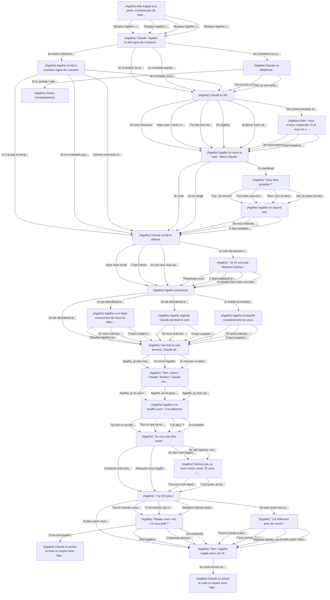
```mermaid
flowchart TD
    I1["(Agathe) Elle frappe à la porte, n’entend pas de répo…"]
    I2["(Agathe) 'Claude'. Agathe lui fait signe de s’asseoir…"]
    I3["(Agathe) Agathe lui fait à nouveau signe de s’asseoir."]
    I4["(Agathe) Claude au téléphone :"]
    I5["(Agathe) Claude lui dit :"]
    I6["(Agathe) Agathe lui serre la main. 'Merci Claude.'"]
    I7["(Agathe) ''Vous êtes pressée ?''"]
    I8["(Agathe) Claude rompt le silence."]
    I9["(Agathe) ''Je ne suis pas Madame Épiney.''"]
    I10["(Agathe) Agathe acquiesce."]
    I11["(Agathe) Agathe a un léger mouvement de recul au débu…"]
    I12["(Agathe) Agathe regarde Claude pendant le soin"]
    I13["(Agathe) Agathe écarquille soudainement les yeux."]
    I14["(Agathe) Une fois le soin terminé, Claude dit :"]
    I15["(Agathe) ''Non, restez ! Claude ! Restez ! Claude res…"]
    I16["(Agathe) Agathe a le souffle court :''J’ai tellement …"]
    I17["(Agathe) ''Je veux pas être seule.''"]
    I18["(Agathe) Surtout pas, je veux mourir seule. Et vous l…"]
    I19["(Agathe) ''J’ai très peur.''"]
    I20["(Agathe) ''Restez avec moi, s’il vous plaît !''"]
    I21["(Agathe) Claude lui prend la main et respire avec Aga…"]
    I22["(Agathe) ''J’ai tellement peur de mourir.''"]
    I23["(Agathe) ''Non ! Agathe s’agite dans son lit.''"]
    I24["(Agathe) Claude lui prend la main et respire avec Aga…"]
    I25["(Agathe) Sortez immédiatement"]
    I26["(Agathe) Rien. Vous m’avez respectée. Et je vous en s…"]
    I27["(Agathe) Agathe ne répond pas"]

    I1 -->|"''Bonjour Agathe, c…"| I2
    I1 -->|"''Bonjour Agathe, j…"| I2
    I1 -->|"''Bonjour Agathe, o…"| I2
    I1 -->|"''Bonjour Agathe, j…"| I2
    I2 -->|"Je m’assied, lui pr…"| I5
    I2 -->|"Je reste à distance…"| I3
    I2 -->|"Je m’assied et en p…"| I4
    I2 -->|"Je m’assied auprès …"| I5
    I3 -->|"Je m’assied, lui pr…"| I5
    I3 -->|"Je n’ai pas le temp…"| I8
    I3 -->|"Je ne m’assieds pas…"| I8
    I3 -->|"Comme j’aimerais m’…"| I8
    I4 -->|"''Oui je suis occup…"| I5
    I4 -->|"''Oui, je suis avec…"| I5
    I4 -->|"Si tu sentais l’ode…"| I25
    I5 -->|"Vos remerciements m…"| I26
    I5 -->|"''Je suis heureuse''"| I6
    I5 -->|"Mais vous n’avez vr…"| I6
    I5 -->|"''J’ai fait mon tra…"| I6
    I5 -->|"Oh Agathe,"| I6
    I5 -->|"Je laisse sortir se…"| I6
    I6 -->|"Je reste"| I8
    I6 -->|"Je me dirige"| I8
    I6 -->|"Je manifeste"| I7
    I7 -->|"''Oui, j’ai encore''"| I27
    I7 -->|"''Oui mais rassurez…"| I27
    I7 -->|"''Non, tout va bien…"| I27
    I7 -->|"Qui va piano va san…"| I27
    I8 -->|"Avez-vous envie"| I10
    I8 -->|"C’est l’heure"| I10
    I8 -->|"Je vois que vous av…"| I10
    I8 -->|"Le soin de bouche s…"| I9
    I9 -->|"''Pardonnez-moi,''"| I10
    I9 -->|"C’était maladroit d…"| I10
    I9 -->|"Il n’empêche"| I10
    I9 -->|"''Oui mais vous ête…"| I10
    I10 -->|"Je me désinfecte le…"| I14
    I10 -->|"Je me désinfecte le…"| I11
    I10 -->|"Je me désinfecte le…"| I12
    I10 -->|"Je imbibe la compre…"| I13
    I11 -->|"Désolée Agathe j’ai…"| I14
    I11 -->|"''Je vous entends. …"| I14
    I11 -->|"''Il faut coopérer,…"| I14
    I12 -->|"..."| I14
    I12 -->|"''Je vous entends. …"| I14
    I12 -->|"''Il faut coopérer,…"| I14
    I13 -->|"..."| I14
    I13 -->|"''Je vous entends. …"| I14
    I13 -->|"''Il faut coopérer,…"| I14
    I14 -->|"Agathe, je dois mai…"| I15
    I14 -->|"Au revoir Agathe."| I15
    I14 -->|"Je n’ai pas vu pass…"| I15
    I15 -->|"Agathe, je ne peux …"| I16
    I15 -->|"Agathe, je ne peux …"| I16
    I15 -->|"Agathe, je sens qu’…"| I16
    I16 -->|"''Qu’est-ce qu’elle…"| I17
    I16 -->|"''Est-ce que ça va …"| I17
    I16 -->|"''J’ai peur ?''"| I17
    I16 -->|"Je m’assied"| I17
    I17 -->|"J’entends votre bes…"| I19
    I17 -->|"Je veux que j’appel…"| I18
    I17 -->|"Je vais appeler vos…"| I18
    I17 -->|"Rassurez-vous Agath…"| I19
    I18 -->|"''Excusez-moi Agath…"| I19
    I18 -->|"C’est juste, je sui…"| I19
    I19 -->|"De quoi avez-vous p…"| I22
    I19 -->|"Tout le monde a peu…"| I20
    I19 -->|"C’est normal. Qui n…"| I20
    I19 -->|"Madame Epiney aussi…"| I20
    I19 -->|"Je dois partir main…"| I23
    I20 -->|"''Non Agathe,''"| I23
    I20 -->|"''D’accord Agathe,''"| I21
    I20 -->|"''J’aimerais beauco…"| I23
    I20 -->|"Ça va passer,"| I23
    I22 -->|"Tout le monde a peu…"| I23
    I22 -->|"C’est normal. Qui n…"| I23
    I22 -->|"Madame Epiney aussi…"| I23
    I22 -->|"Je dois partir main…"| I23
    I23 -->|"Je reste encore un …"| I24
    I26 -->|"..."| I6
    I26 -->|"''Je vous entends. …"| I6
    I26 -->|"''Il faut coopérer,…"| I6
    I27 -->|"..."| I8
    I27 -->|"''Je vous entends. …"| I8
    I27 -->|"''Il faut coopérer,…"| I8
```

*27 nœuds, 85 arêtes*

---

### Scénario : Conflit intérieur

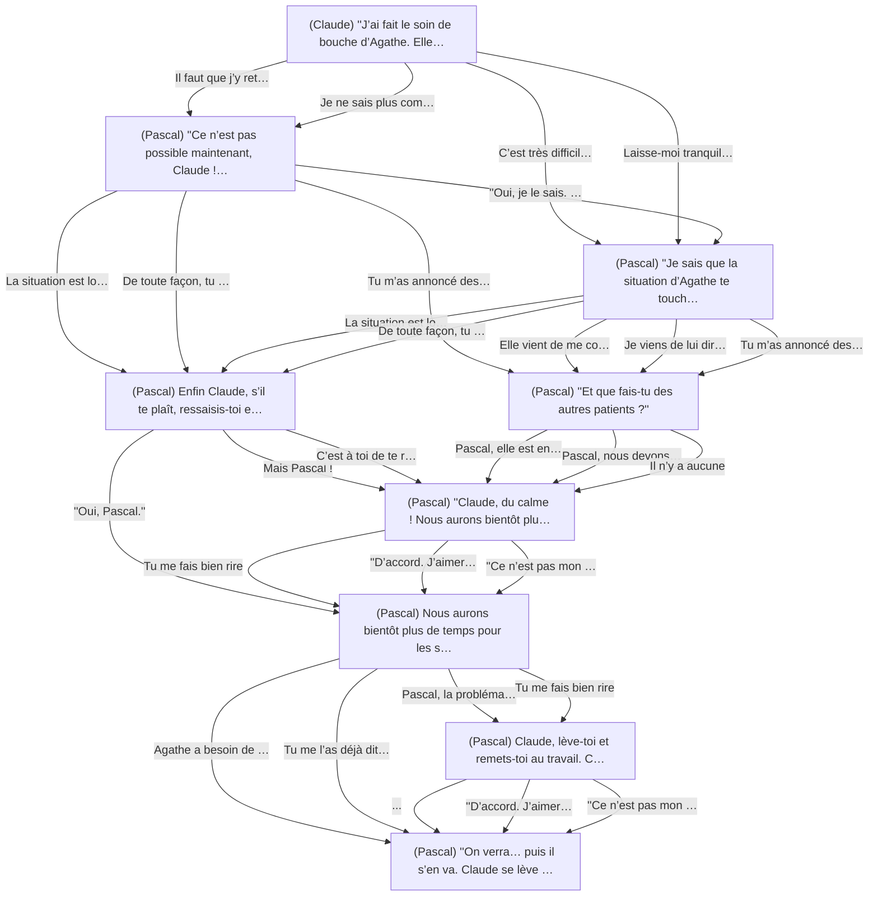
```mermaid
flowchart TD
    I1["(Claude) ''J’ai fait le soin de bouche d’Agathe. Elle…"]
    I2["(Pascal) ''Ce n’est pas possible maintenant, Claude !…"]
    I3["(Pascal) ''Je sais que la situation d’Agathe te touch…"]
    I4["(Pascal) Enfin Claude, s’il te plaît, ressaisis-toi e…"]
    I5["(Pascal) ''Et que fais-tu des autres patients ?''"]
    I6["(Pascal) ''Claude, du calme ! Nous aurons bientôt plu…"]
    I7["(Pascal) Nous aurons bientôt plus de temps pour les s…"]
    I8["(Pascal) Claude, lève-toi et remets-toi au travail. C…"]
    I9["(Pascal) ''On verra… puis il s’en va. Claude se lève …"]

    I1 -->|"Il faut que j’y ret…"| I2
    I1 -->|"Je ne sais plus com…"| I2
    I1 -->|"C’est très difficil…"| I3
    I1 -->|"Laisse-moi tranquil…"| I3
    I2 -->|"''Oui, je le sais. …"| I3
    I2 -->|"La situation est lo…"| I4
    I2 -->|"Tu m’as annoncé des…"| I5
    I2 -->|"De toute façon, tu …"| I4
    I3 -->|"Elle vient de me co…"| I5
    I3 -->|"Je viens de lui dir…"| I5
    I3 -->|"La situation est lo…"| I4
    I3 -->|"Tu m’as annoncé des…"| I5
    I3 -->|"De toute façon, tu …"| I4
    I4 -->|"''Oui, Pascal.''"| I7
    I4 -->|"Mais Pascal !"| I6
    I4 -->|"C’est à toi de te r…"| I6
    I5 -->|"Pascal, elle est en…"| I6
    I5 -->|"Pascal, nous devons…"| I6
    I5 -->|"Il n’y a aucune"| I6
    I6 -->|"Tu me fais bien rire"| I7
    I6 -->|"''D’accord. J’aimer…"| I7
    I6 -->|"''Ce n’est pas mon …"| I7
    I7 -->|"Agathe a besoin de …"| I9
    I7 -->|"Tu me l’as déjà dit…"| I9
    I7 -->|"Pascal, la probléma…"| I8
    I7 -->|"Tu me fais bien rire"| I8
    I8 -->|"..."| I9
    I8 -->|"''D’accord. J’aimer…"| I9
    I8 -->|"''Ce n’est pas mon …"| I9
```

*9 nœuds, 29 arêtes*

---

### Scénario : Rupture du lien

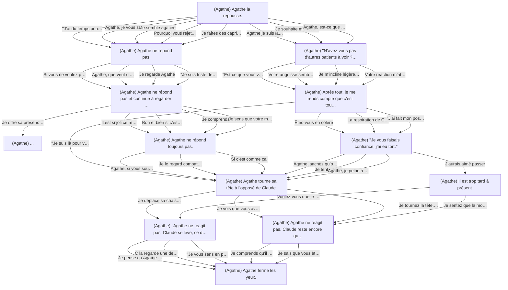
```mermaid
flowchart TD
    I1["(Agathe) Agathe la repousse."]
    I2["(Agathe) Agathe ne répond pas."]
    I3["(Agathe) ''N’avez-vous pas d’autres patients à voir ?…"]
    I4["(Agathe) Agathe ne répond pas et continue à regarder …"]
    I5["(Agathe) ..."]
    I6["(Agathe) Après tout, je me rends compte que c’est tou…"]
    I7["(Agathe) Agathe ne répond toujours pas."]
    I8["(Agathe) ''Je vous faisais confiance, j’ai eu tort.''"]
    I9["(Agathe) Agathe tourne sa tête à l’opposé de Claude."]
    I10["(Agathe) Il est trop tard à présent."]
    I11["(Agathe) ''Agathe ne réagit pas. Claude se lève, se d…"]
    I12["(Agathe) Agathe ne réagit pas. Claude reste encore qu…"]
    I13["(Agathe) Agathe ferme les yeux."]

    I1 -->|"''J’ai du temps pou…"| I2
    I1 -->|"Agathe, je vous sen…"| I2
    I1 -->|"Agathe je suis là…"| I3
    I1 -->|"Je souhaite m’excus…"| I3
    I1 -->|"Je semble agacée"| I2
    I1 -->|"Pourquoi vous rejet…"| I2
    I1 -->|"Je faîtes des capri…"| I2
    I1 -->|"Agathe, est-ce que …"| I3
    I2 -->|"Si vous ne voulez p…"| I4
    I2 -->|"Agathe, que veut di…"| I4
    I2 -->|"Je regarde Agathe"| I4
    I2 -->|"''Je suis triste de…"| I4
    I3 -->|"''Est-ce que vous v…"| I6
    I3 -->|"Votre angoisse semb…"| I6
    I3 -->|"Je m’incline légère…"| I6
    I3 -->|"Votre réaction m’at…"| I6
    I4 -->|"Il est si joli ce m…"| I7
    I4 -->|"Bon et bien si c’es…"| I7
    I4 -->|"Je comprends"| I7
    I4 -->|"Je sens que votre m…"| I7
    I4 -->|"Je offre sa présenc…"| I5
    I6 -->|"Êtes-vous en colère"| I8
    I6 -->|"La respiration de C…"| I8
    I6 -->|"''J’ai fait mon pos…"| I8
    I6 -->|"''Je suis là pour v…"| I9
    I7 -->|"Agathe, si vous sou…"| I9
    I7 -->|"Je le regard compat…"| I9
    I7 -->|"Si c’est comme ça,"| I9
    I8 -->|"J’aurais aimé passer"| I10
    I8 -->|"Agathe, sachez qu’o…"| I9
    I8 -->|"Je tente de lui"| I9
    I8 -->|"Agathe, je peine à …"| I9
    I9 -->|"Je vois que vous av…"| I12
    I9 -->|"Je tournez la tête.…"| I12
    I9 -->|"Je déplace sa chais…"| I11
    I10 -->|"Je sentez que la mo…"| I12
    I10 -->|"Voulez-vous que je …"| I11
    I11 -->|"Je pense qu’Agathe …"| I13
    I11 -->|"C la regarde une de…"| I13
    I11 -->|"''Je vous sens en p…"| I13
    I12 -->|"Je comprends qu’il …"| I13
    I12 -->|"Je sais que vous êt…"| I13
```

*13 nœuds, 42 arêtes*

---

## Chapitre 5 : Le deuil

### Scénario : Le deuil

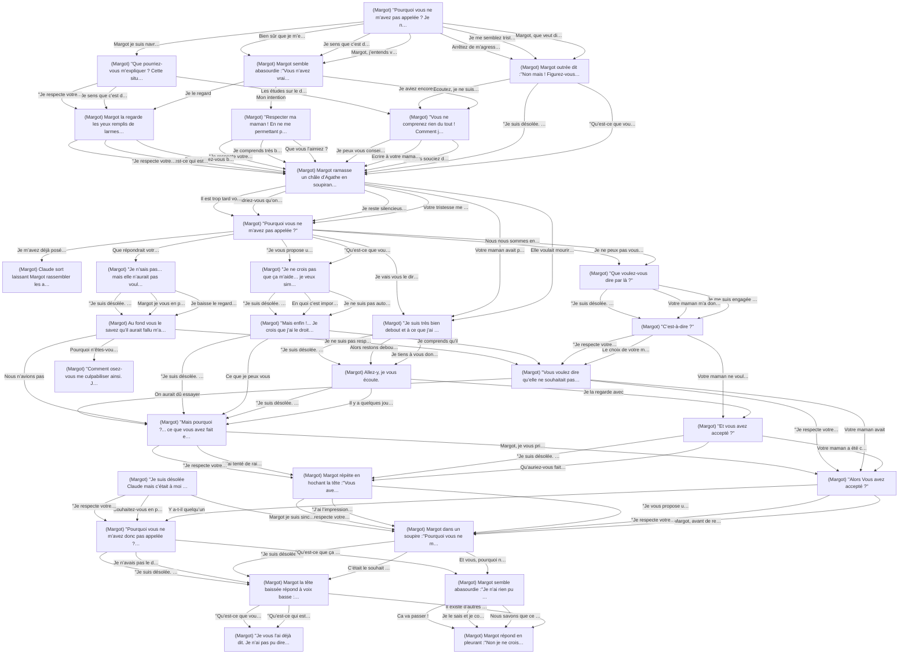
```mermaid
flowchart TD
    I1["(Margot) ''Pourquoi vous ne m’avez pas appelée ? Je n…"]
    I2["(Margot) Margot semble abasourdie :''Vous n’avez vrai…"]
    I3["(Margot) Margot outrée dit :''Non mais ! Figurez-vous…"]
    I4["(Margot) ''Que pourriez-vous m’expliquer ? Cette situ…"]
    I5["(Margot) ''Vous ne comprenez rien du tout ! Comment j…"]
    I6["(Margot) ''Respecter ma maman ! En ne me permettant p…"]
    I7["(Margot) Margot la regarde les yeux remplis de larmes…"]
    I8["(Margot) Margot ramasse un châle d’Agathe en soupiran…"]
    I9["(Margot) ''Pourquoi vous ne m’avez pas appelée ?''"]
    I10["(Margot) Claude sort laissant Margot rassembler les a…"]
    I11["(Margot) ''Je suis très bien debout et à ce que j’ai …"]
    I12["(Margot) ''Que voulez-vous dire par là ?''"]
    I13["(Margot) ''Je ne crois pas que ça m’aide… je veux sim…"]
    I14["(Margot) ''Je n’sais pas… mais elle n’aurait pas voul…"]
    I15["(Margot) Allez-y, je vous écoute."]
    I16["(Margot) ''C’est-à-dire ?''"]
    I17["(Margot) ''Mais enfin !... Je crois que j’ai le droit…"]
    I18["(Margot) Au fond vous le savez qu’il aurait fallu m’a…"]
    I19["(Margot) ''Et vous avez accepté ?''"]
    I20["(Margot) ''Comment osez-vous me culpabiliser ainsi. J…"]
    I21["(Margot) ''Vous voulez dire qu’elle ne souhaitait pas…"]
    I22["(Margot) ''Mais pourquoi ?... ce que vous avez fait e…"]
    I23["(Margot) ''Alors Vous avez accepté ?''"]
    I24["(Margot) Margot répète en hochant la tête :''Vous ave…"]
    I25["(Margot) ''Je suis désolée Claude mais c’était à moi …"]
    I26["(Margot) Margot dans un soupire :''Pourquoi vous ne m…"]
    I27["(Margot) ''Pourquoi vous ne m’avez donc pas appelée ?…"]
    I28["(Margot) Margot la tête baissée répond à voix basse :…"]
    I29["(Margot) Margot semble abasourdie :''Je n’ai rien pu …"]
    I30["(Margot) ''Je vous l’ai déjà dit. Je n’ai pas pu dire…"]
    I31["(Margot) Margot répond en pleurant :''Non je ne crois…"]

    I1 -->|"Margot, j’entends v…"| I2
    I1 -->|"Je sens que c’est d…"| I2
    I1 -->|"Margot, que veut di…"| I3
    I1 -->|"Margot je suis navr…"| I4
    I1 -->|"Je me semblez trist…"| I3
    I1 -->|"Bien sûr que je m’e…"| I2
    I1 -->|"Arrêtez de m’agress…"| I3
    I2 -->|"Mon intention"| I6
    I2 -->|"Je aviez encore bea…"| I5
    I2 -->|"Je le regard"| I7
    I3 -->|"''Qu’est-ce que vou…"| I8
    I3 -->|"Ecoutez, je ne suis…"| I5
    I3 -->|"''Je suis désolée. …"| I8
    I4 -->|"Je sens que c’est d…"| I7
    I4 -->|"Les études sur le d…"| I5
    I4 -->|"''Je respecte votre…"| I7
    I5 -->|"''Je vous souciez d…"| I8
    I5 -->|"Ecrire à votre mama…"| I8
    I5 -->|"Je peux vous consei…"| I8
    I6 -->|"Que vous l’aimiez ?"| I8
    I6 -->|"Je comprends très b…"| I8
    I6 -->|"''Je respecte votre…"| I8
    I7 -->|"De quoi avez-vous b…"| I8
    I7 -->|"''Qu’est-ce qui est…"| I8
    I7 -->|"''Je respecte votre…"| I8
    I8 -->|"Votre tristesse me …"| I9
    I8 -->|"Je reste silencieus…"| I9
    I8 -->|"Voudriez-vous qu’on…"| I9
    I8 -->|"Il est trop tard vo…"| I9
    I8 -->|"Elle voulait mourir…"| I11
    I8 -->|"Votre maman avait p…"| I11
    I9 -->|"Je vais vous le dir…"| I11
    I9 -->|"Nous nous sommes en…"| I12
    I9 -->|"''Qu’est-ce que vou…"| I13
    I9 -->|"Que répondrait votr…"| I14
    I9 -->|"Je ne peux pas vous…"| I12
    I9 -->|"Je m’avez déjà posé…"| I10
    I9 -->|"''Je vous propose u…"| I13
    I11 -->|"Je tiens à vous don…"| I15
    I11 -->|"Alors restons debou…"| I15
    I11 -->|"''Je suis désolée. …"| I15
    I12 -->|"Je me suis engagée …"| I16
    I12 -->|"Votre maman m’a don…"| I16
    I12 -->|"''Je suis désolée. …"| I16
    I13 -->|"Je ne suis pas auto…"| I17
    I13 -->|"En quoi c’est impor…"| I17
    I13 -->|"''Je suis désolée. …"| I17
    I14 -->|"Je baisse le regard…"| I18
    I14 -->|"Margot je vous en p…"| I18
    I14 -->|"''Je suis désolée. …"| I18
    I15 -->|"Il y a quelques jou…"| I22
    I15 -->|"Je la regarde avec"| I19
    I15 -->|"''Je suis désolée. …"| I22
    I16 -->|"Le choix de votre m…"| I21
    I16 -->|"Votre maman ne voul…"| I19
    I16 -->|"''Je respecte votre…"| I21
    I17 -->|"Ce que je peux vous"| I22
    I17 -->|"Je comprends qu’il"| I21
    I17 -->|"''Je suis désolée. …"| I22
    I18 -->|"Nous n’avions pas"| I22
    I18 -->|"Pourquoi n’êtes-vou…"| I20
    I18 -->|"Je ne suis pas resp…"| I21
    I19 -->|"Qu’auriez-vous fait…"| I24
    I19 -->|"Votre maman a été c…"| I23
    I19 -->|"''Je suis désolée. …"| I24
    I21 -->|"Votre maman avait"| I23
    I21 -->|"On aurait dû essayer"| I22
    I21 -->|"''Je respecte votre…"| I23
    I22 -->|"''J’ai tenté de rai…"| I24
    I22 -->|"Margot, je vous pri…"| I23
    I22 -->|"''Je respecte votre…"| I24
    I23 -->|"Margot, avant de re…"| I26
    I23 -->|"Y a-t-il quelqu’un"| I27
    I23 -->|"''Je respecte votre…"| I26
    I24 -->|"''Je vous propose u…"| I26
    I24 -->|"''J’ai l’impression…"| I26
    I24 -->|"''Je respecte votre…"| I26
    I25 -->|"Souhaitez-vous en p…"| I27
    I25 -->|"Margot je suis sinc…"| I26
    I25 -->|"''Je respecte votre…"| I27
    I26 -->|"C’était le souhait …"| I28
    I26 -->|"Et vous, pourquoi n…"| I29
    I26 -->|"''Je suis désolée. …"| I28
    I27 -->|"Je n’avais pas le d…"| I28
    I27 -->|"''Qu’est-ce que ça …"| I29
    I27 -->|"''Je suis désolée. …"| I28
    I28 -->|"''Qu’est-ce qui est…"| I30
    I28 -->|"''Qu’est-ce que vou…"| I30
    I28 -->|"Il existe d’autres …"| I31
    I29 -->|"Nous savons que ce …"| I31
    I29 -->|"Je le sais et je co…"| I31
    I29 -->|"Ca va passer !"| I31
```

*31 nœuds, 92 arêtes*

---

### Scénario : Un nouveau patient en chambre 14

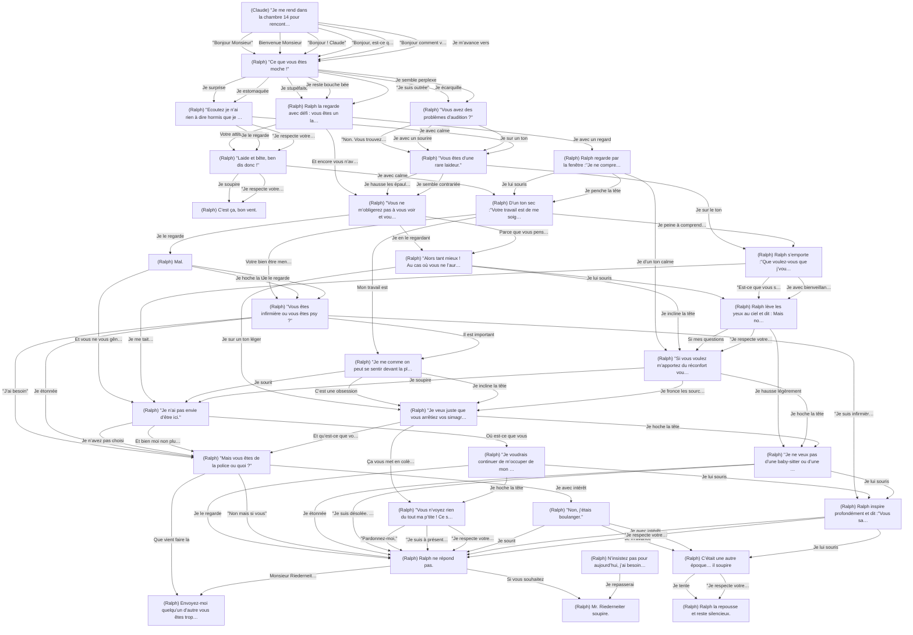
```mermaid
flowchart TD
    I1["(Claude) ''Je me rend dans la chambre 14 pour rencont…"]
    I2["(Ralph) ''Ce que vous êtes moche !''"]
    I3["(Ralph) ''Vous avez des problèmes d’audition ?''"]
    I4["(Ralph) Ralph la regarde avec défi : vous êtes un la…"]
    I5["(Ralph) ''Ecoutez je n’ai rien à dire hormis que je …"]
    I6["(Ralph) ''Vous êtes d’une rare laideur.''"]
    I7["(Ralph) ''Laide et bête, ben dis donc !''"]
    I8["(Ralph) C’est ça, bon vent."]
    I9["(Ralph) Ralph regarde par la fenêtre :''Je ne compre…"]
    I10["(Ralph) ''Vous ne m’obligerez pas à vous voir et vou…"]
    I11["(Ralph) D’un ton sec :''Votre travail est de me soig…"]
    I12["(Ralph) Mal."]
    I13["(Ralph) ''Alors tant mieux ! Au cas où vous ne l’aur…"]
    I14["(Ralph) Ralph s’emporte :''Que voulez-vous que j’vou…"]
    I15["(Ralph) ''Vous êtes infirmière ou vous êtes psy ?''"]
    I16["(Ralph) Ralph lève les yeux au ciel et dit : Mais no…"]
    I17["(Ralph) ''Je me comme on peut se sentir devant la pl…"]
    I18["(Ralph) ''Si vous voulez m’apportez du réconfort vou…"]
    I19["(Ralph) ''Je n’ai pas envie d’être ici.''"]
    I20["(Ralph) ''Je veux juste que vous arrêtiez vos simagr…"]
    I21["(Ralph) ''Je voudrais continuer de m’occuper de mon …"]
    I22["(Ralph) ''Mais vous êtes de la police ou quoi ?''"]
    I23["(Ralph) ''Je ne veux pas d’une baby-sitter ou d’une …"]
    I24["(Ralph) ''Vous n’voyez rien du tout ma p’tite ! Ce s…"]
    I25["(Ralph) ''Non, j’étais boulanger.''"]
    I26["(Ralph) Ralph inspire profondément et dit :''Vous sa…"]
    I27["(Ralph) Ralph ne répond pas."]
    I28["(Ralph) C’était une autre époque… il soupire"]
    I29["(Ralph) Envoyez-moi quelqu’un d’autre vous êtes trop…"]
    I30["(Ralph) Ralph la repousse et reste silencieux."]
    I31["(Ralph) N’insistez pas pour aujourd’hui, j’ai besoin…"]
    I32["(Ralph) Mr. Riederneiter soupire."]

    I1 -->|"''Bonjour Monsieur''"| I2
    I1 -->|"Bienvenue Monsieur"| I2
    I1 -->|"''Bonjour ! Claude''"| I2
    I1 -->|"''Bonjour, est-ce q…"| I2
    I1 -->|"''Bonjour comment v…"| I2
    I1 -->|"Je m’avance vers"| I2
    I2 -->|"Je écarquille"| I3
    I2 -->|"Je stupéfaite"| I4
    I2 -->|"Je reste bouche bée"| I4
    I2 -->|"''Je suis outrée''"| I4
    I2 -->|"Je semble perplexe"| I3
    I2 -->|"Je surprise"| I5
    I2 -->|"Je estomaquée"| I5
    I3 -->|"''Non. Vous trouvez…"| I6
    I3 -->|"Je avec un sourire"| I6
    I3 -->|"Je sur un ton"| I6
    I4 -->|"Et encore vous n’av…"| I10
    I4 -->|"Je avec un regard"| I9
    I4 -->|"Votre attitude m’ét…"| I7
    I5 -->|"Je le regarde"| I7
    I5 -->|"Je avec calme"| I6
    I5 -->|"''Je respecte votre…"| I7
    I6 -->|"Je hausse les épaul…"| I10
    I6 -->|"Je semble contrariée"| I10
    I6 -->|"Je sur le ton"| I14
    I7 -->|"Je soupire"| I8
    I7 -->|"Je avec calme"| I11
    I7 -->|"''Je respecte votre…"| I8
    I9 -->|"Je lui souris"| I11
    I9 -->|"Je penche la tête"| I11
    I9 -->|"Je d’un ton calme"| I18
    I10 -->|"Je le regarde"| I12
    I10 -->|"Je en le regardant"| I13
    I10 -->|"Parce que vous pens…"| I13
    I11 -->|"Mon travail est"| I17
    I11 -->|"Je peine à comprend…"| I14
    I11 -->|"Votre bien être men…"| I15
    I12 -->|"Je hoche la tête"| I15
    I12 -->|"Et vous ne vous gên…"| I19
    I12 -->|"Je le regarde"| I15
    I13 -->|"Je lui souris"| I16
    I13 -->|"Je sur un ton léger"| I20
    I13 -->|"Je incline la tête"| I18
    I14 -->|"Je me tait…"| I19
    I14 -->|"''Est-ce que vous s…"| I16
    I14 -->|"Je avec bienveillan…"| I16
    I15 -->|"Il est important"| I17
    I15 -->|"''Je suis infirmièr…"| I26
    I15 -->|"''J’ai besoin''"| I22
    I15 -->|"Je étonnée"| I22
    I16 -->|"Si mes questions"| I18
    I16 -->|"Je hausse légèrement"| I23
    I16 -->|"''Je respecte votre…"| I18
    I17 -->|"Je sourit"| I19
    I17 -->|"C’est une obsession"| I20
    I17 -->|"Je incline la tête"| I20
    I18 -->|"Je soupire"| I19
    I18 -->|"Je hoche la tête"| I23
    I18 -->|"Je fronce les sourc…"| I20
    I19 -->|"Où est-ce que vous"| I21
    I19 -->|"Je n’avez pas choisi"| I22
    I19 -->|"Et bien moi non plu…"| I22
    I20 -->|"Je hoche la tête"| I23
    I20 -->|"Ça vous met en colè…"| I24
    I20 -->|"Et qu’est-ce que vo…"| I22
    I21 -->|"Je hoche la tête"| I24
    I21 -->|"Je lui souris"| I26
    I21 -->|"Je le regarde"| I27
    I22 -->|"Je avec intérêt"| I25
    I22 -->|"''Non mais si vous''"| I27
    I22 -->|"Que vient faire la"| I29
    I23 -->|"Je étonnée"| I27
    I23 -->|"Je lui souris"| I26
    I23 -->|"''Je suis désolée. …"| I27
    I24 -->|"''Pardonnez-moi,''"| I27
    I24 -->|"''Je suis à présent…"| I27
    I24 -->|"''Je respecte votre…"| I27
    I25 -->|"Je sourit"| I27
    I25 -->|"Je m’avance"| I28
    I25 -->|"Je avec intérêt"| I28
    I26 -->|"Je avec intérêt"| I27
    I26 -->|"Je lui souris"| I28
    I26 -->|"''Je respecte votre…"| I27
    I27 -->|"Monsieur Riederneit…"| I29
    I27 -->|"Si vous souhaitez"| I32
    I28 -->|"Je tente"| I30
    I28 -->|"''Je respecte votre…"| I30
    I31 -->|"Je repasserai"| I32
```

*32 nœuds, 88 arêtes*

---

### Scénario : Comment faire son deuil

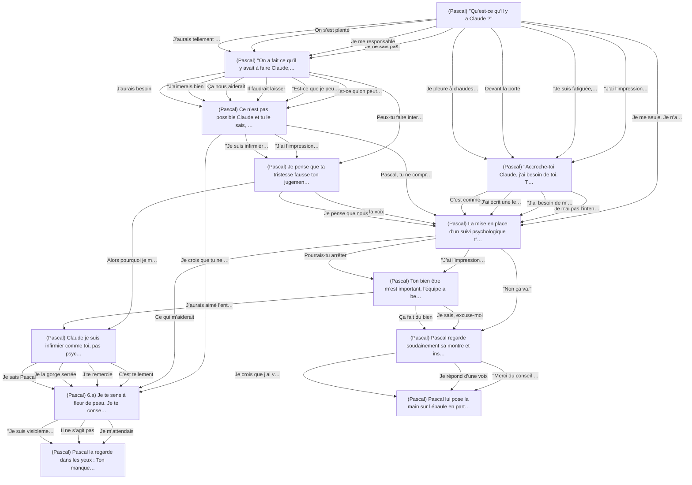
```mermaid
flowchart TD
    I1["(Pascal) ''Qu’est-ce qu’il y a Claude ?''"]
    I2["(Pascal) ''On a fait ce qu’il y avait à faire Claude,…"]
    I3["(Pascal) ''Accroche-toi Claude, j’ai besoin de toi. T…"]
    I4["(Pascal) Ce n’est pas possible Claude et tu le sais, …"]
    I5["(Pascal) Je pense que ta tristesse fausse ton jugemen…"]
    I6["(Pascal) La mise en place d’un suivi psychologique t’…"]
    I7["(Pascal) Ton bien être m’est important, l’équipe a be…"]
    I8["(Pascal) Claude je suis infirmier comme toi, pas psyc…"]
    I9["(Pascal) Pascal regarde soudainement sa montre et ins…"]
    I10["(Pascal) 6.a) Je te sens à fleur de peau. Je te conse…"]
    I11["(Pascal) Pascal lui pose la main sur l’épaule en part…"]
    I12["(Pascal) Pascal la regarde dans les yeux : Ton manque…"]

    I1 -->|"Je ne sais pas."| I2
    I1 -->|"''J’ai l’impression…"| I3
    I1 -->|"Je me responsable"| I2
    I1 -->|"On s’est planté"| I2
    I1 -->|"J’aurais tellement …"| I2
    I1 -->|"''Je suis fatiguée,…"| I3
    I1 -->|"Je me seule. Je n’a…"| I6
    I1 -->|"Devant la porte"| I3
    I1 -->|"Je pleure à chaudes…"| I3
    I2 -->|"''Est-ce qu’on peut…"| I4
    I2 -->|"''Est-ce que je peu…"| I4
    I2 -->|"Il faudrait laisser"| I4
    I2 -->|"Ça nous aiderait"| I4
    I2 -->|"''J’aimerais bien''"| I4
    I2 -->|"J’aurais besoin"| I4
    I2 -->|"Peux-tu faire inter…"| I5
    I3 -->|"Je n’ai pas l’inten…"| I6
    I3 -->|"''J’ai besoin de m’…"| I6
    I3 -->|"''J’ai écrit une le…"| I6
    I3 -->|"C’est comme"| I6
    I4 -->|"Je crois que tu ne …"| I10
    I4 -->|"Pascal, tu ne compr…"| I6
    I4 -->|"''J’ai l’impression…"| I5
    I4 -->|"''Je suis infirmièr…"| I5
    I5 -->|"Alors pourquoi je m…"| I8
    I5 -->|"Je la voix"| I6
    I5 -->|"Je pense que nous"| I6
    I6 -->|"''J’ai l’impression…"| I7
    I6 -->|"Ce qui m’aiderait"| I10
    I6 -->|"''Non ça va.''"| I9
    I6 -->|"Pourrais-tu arrêter"| I7
    I7 -->|"Je sais, excuse-moi"| I9
    I7 -->|"Ça fait du bien"| I9
    I7 -->|"J’aurais aimé l’ent…"| I8
    I8 -->|"C’est tellement"| I10
    I8 -->|"J’te remercie"| I10
    I8 -->|"Je la gorge serrée"| I10
    I8 -->|"Je sais Pascal"| I10
    I9 -->|"''Merci du conseil …"| I11
    I9 -->|"Je répond d’une voix"| I11
    I9 -->|"Je crois que j’ai v…"| I11
    I10 -->|"Je m’attendais"| I12
    I10 -->|"Il ne s’agit pas"| I12
    I10 -->|"''Je suis visibleme…"| I12
```

*12 nœuds, 44 arêtes*

---
