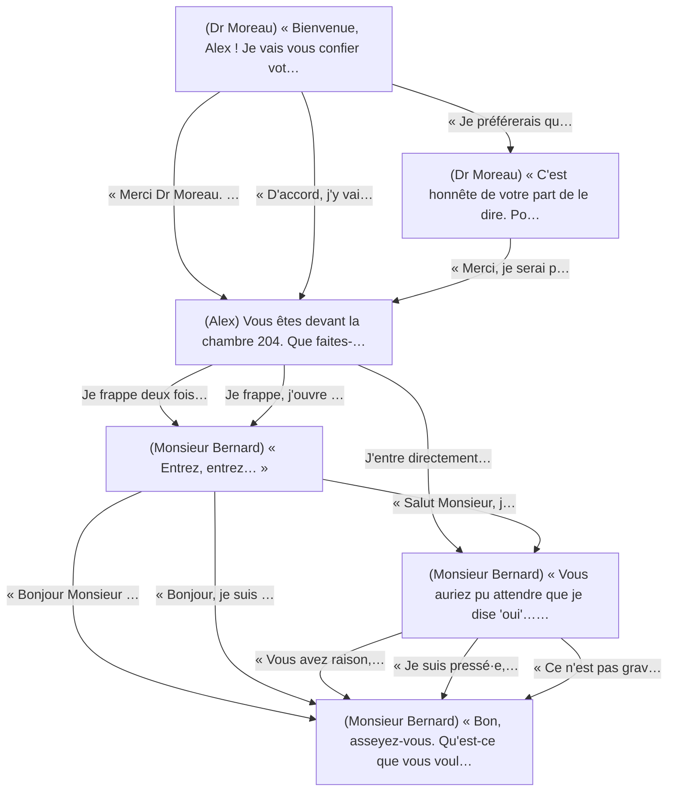
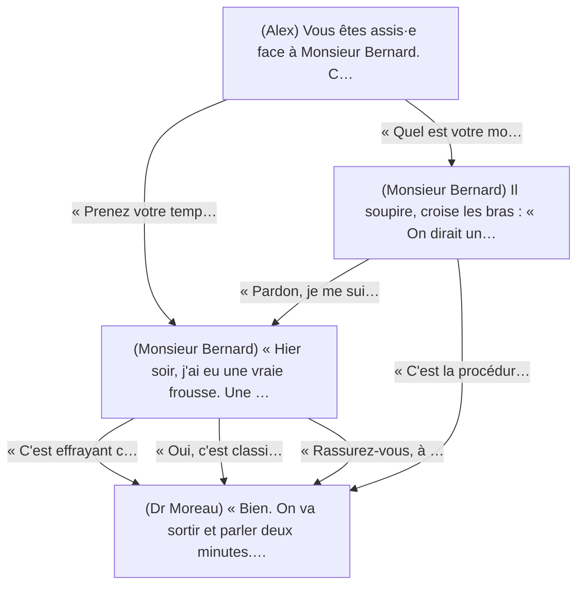
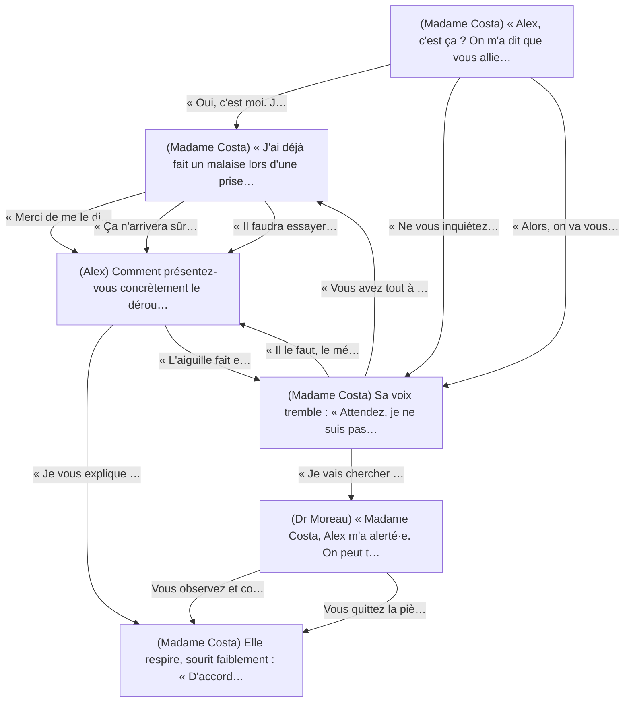
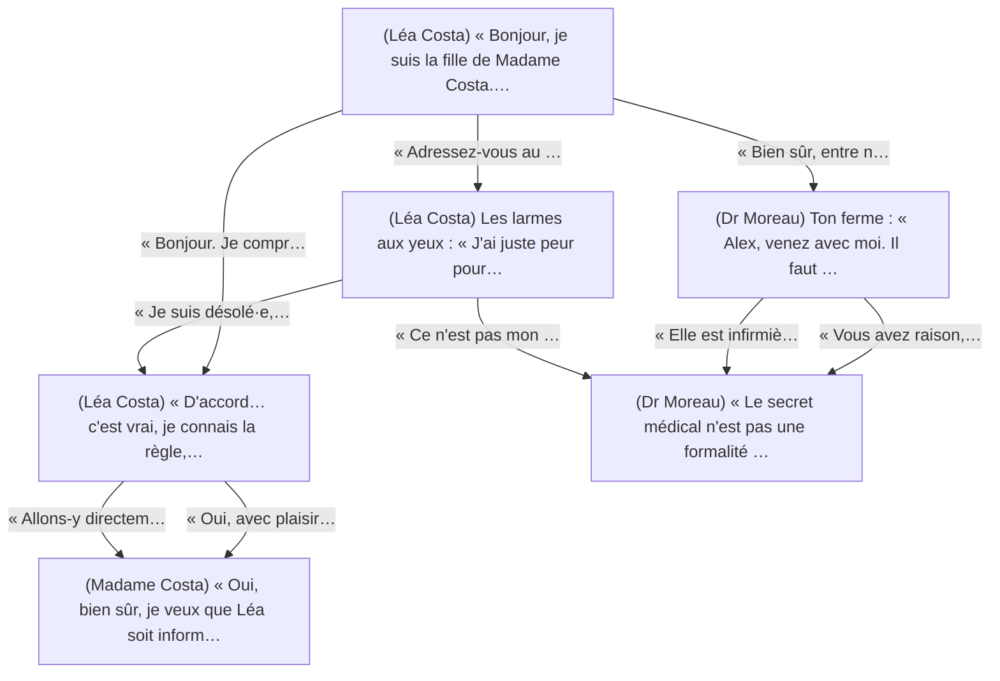

# Graphes — MedStudents Y2

Structure des scénarios — Généré à partir de MedStudents_Y2_v1.json

---

## Chapitre 1 : Premier jour de stage

### Scénario : 1.1 Accueil dans le service

*6 nœuds, 13 arêtes*

---

### Scénario : 1.2 Première anamnèse

*4 nœuds, 7 arêtes*

---

## Chapitre 2 : L'examen qui fait peur

### Scénario : 2.1 Avant la ponction lombaire

*6 nœuds, 13 arêtes*

---

## Chapitre 3 : Secret médical et famille

### Scénario : 3.1 Une demande dans le couloir

*6 nœuds, 9 arêtes*

---
